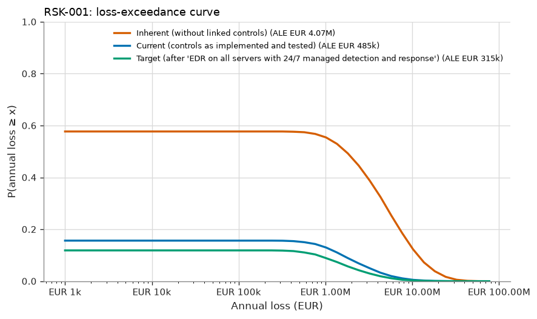
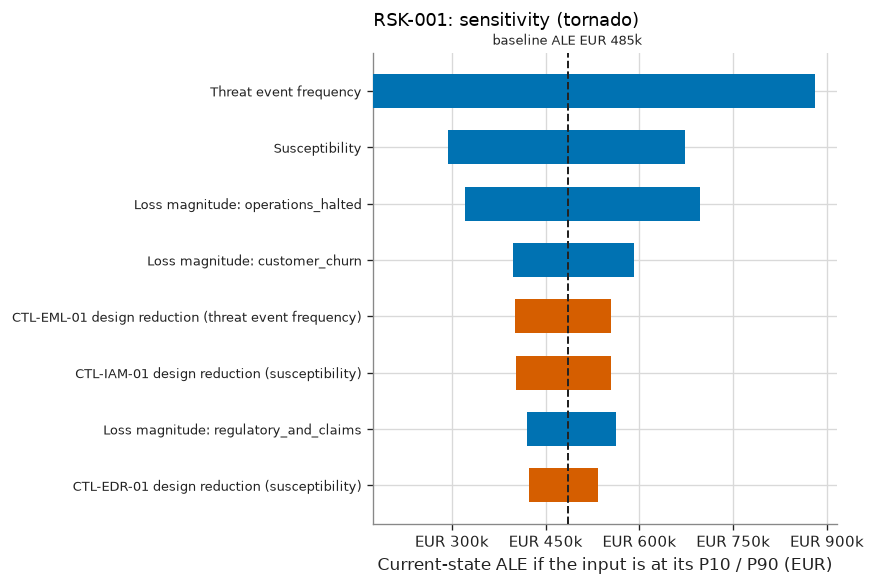
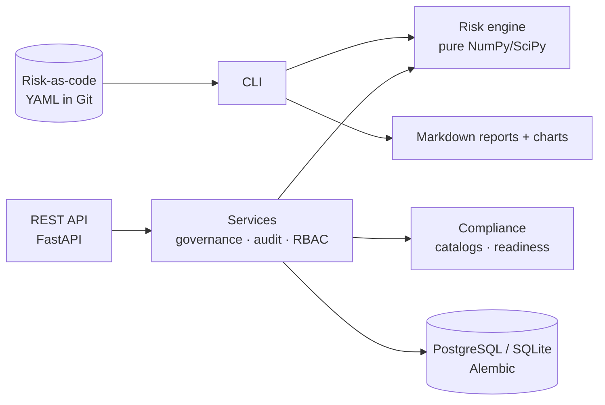

# Sextant

**A quantitative, auditable information-security risk register.** It takes a
threat scenario through to an accepted residual risk, and keeps the evidence,
the maths and the accountability needed to defend every step.

[](https://github.com/ThomasSioumpalas/new-risk-repo-/actions/workflows/ci.yml)


> **See the output without installing anything:** the
> [example register report](examples/reports/README.md) for a fictional
> logistics company, with eight risks, 21 controls, a portfolio view and
> readiness reports for ISO/IEC 27001, NIST CSF 2.0, NIS2 and the NIST AI RMF.

---

## The problem

Most risk registers are spreadsheets with a likelihood × impact score. Those
scores cannot be defended:

* nobody can say where "likelihood 3" came from;
* control effectiveness is a guess ("70 %");
* multiplying ordinal ranks is not valid arithmetic, and matrices can rank
  risks in the wrong order (Cox, 2008);
* uncertainty is invisible;
* cells are overwritten, so there is no history;
* risks are accepted by people without the authority to do so.

Auditors, boards and regulators (ISO/IEC 27001 clause 6.1, NIS2 Art. 21) expect
a risk process that is **systematic, repeatable and evidenced**.

## What Sextant does

For every risk it answers the questions a risk owner, a board member or an
auditor will ask:

| Question | How Sextant answers it |
|---|---|
| **What is the estimated risk?** | Expected annual loss (ALE), probability of a loss event, VaR95 and expected shortfall, loss-exceedance curve |
| **Why is it at this level?** | Explicit banding of loss frequency and per-event loss onto the approved criteria; matrix lookup; appetite checks |
| **How confident are we?** | 90 % credible interval for the ALE, P(true ALE within appetite), data-derived vs expert inputs, Monte Carlo error |
| **What assumptions were made?** | Model assumptions and scenario assumptions listed in every report; each input has a source and rationale |
| **Which controls reduce it?** | Inherent → current reduction; each control's "loss increase if it failed"; test-based operating effectiveness |
| **What if the assumptions change?** | Analytic tornado, rank-correlation "value of information", stress tests (e.g. "MFA fails") |
| **Which mitigation has the greatest effect?** | Treatment options compared on the same simulated years: ΔALE (paired SE), ΔVaR, ΔES, cost, ROSI, residual level |

Around the maths it adds the **governance a real GRC function needs**:

* immutable, reproducible assessments, with a stored input snapshot and SHA-256
  fingerprints;
* overrides that require a justification;
* an authority matrix, escalated for risks outside appetite;
* segregation of duties, time-limited acceptance, and automatic invalidation
  when risk rises;
* an append-only, hash-chained audit log, protected by database triggers.

## Intended users

GRC and risk analysts · risk owners and executives · CISOs and risk managers
(2nd line) · internal and external auditors (3rd line) · control owners · AI
governance teams.

## Example output

| Risk matrix (quantitative placement) | Current ALE with 90 % credible intervals |
|---|---|
|  |  |

| Ransomware: loss-exceedance curves | Ransomware: what drives the estimate |
|---|---|
|  |  |

Some findings from the example register:

* **The matrix and the money disagree.** The LLM prompt-injection scenario
  (RSK-008) rates *Low* on the matrix (frequent events with small losses each),
  yet its expected annual loss (€515k) is **above** the €500k appetite. The
  outside-appetite rule escalates its acceptance to an executive.
* **Ransomware (RSK-001)** falls from an inherent ALE of €4.07M to a current
  €485k: just inside appetite, but with a wide credible interval. The report
  gives the probability that it is truly within appetite, which is a very
  different decision input from a green tick.
* **Cheapest is not best.** Insurance has the best ROSI for ransomware, but it
  does nothing about the likelihood of a warehouse outage. The report puts
  ΔALE, ΔVaR, cost and residual level side by side.
* **Evidence matters.** Backup restores failed once in 12 tests, so the
  quarterly control is concluded *not effective* under the audit convention,
  and the model credits it with its posterior operating rate (≈ 86 %), not
  100 %.

## Standards and frameworks

| Framework | How it is used |
|---|---|
| ISO 31000:2018 | Process backbone (criteria → identify → analyse → evaluate → treat → monitor, record) |
| ISO/IEC 27005:2022 | Event-based scenarios, treatment options (modify/share/avoid/retain) |
| ISO/IEC 27001:2022 | Clause 6.1.2/6.1.3 implementation; clauses 4–10 and Annex A **identifiers** for mapping; draft SoA |
| NIST SP 800-30 Rev. 1 | Threat-source taxonomy; default risk-matrix structure (Table I-2) |
| NIST CSF 2.0 | 106 subcategories, generated from NIST's official OSCAL catalog |
| FAIR (Open Group O-RT/O-RA) | Quantitative ontology (TEF × susceptibility; primary and secondary loss) |
| NIS2 (EU) 2022/2555 | Art. 20, 21(2)(a–j) and 23 as a regulatory requirement set |
| NIST AI RMF 1.0 | AI risk scenarios mapped to GOVERN / MAP / MEASURE / MANAGE |
| NIST IR 8477 | Set-theory relationship types for mappings (equal, subset, superset, intersects) |

> **Readiness, not compliance.** Sextant separates *risk assessment*,
> *control assessment*, *evidence*, *compliance mapping*, *readiness* and
> *certification*. It never states that an organisation is "compliant" or
> "certified". Only an accredited certification body can conclude that. No
> copyrighted ISO text is reproduced. See
> [COMPLIANCE_MAPPING.md](docs/COMPLIANCE_MAPPING.md).

## Methodology in brief

* **Criteria as data.** Scales, matrix, appetite, the tolerance curve, the
  acceptance authority and review cycles live in a versioned, fingerprinted
  [methodology file](src/sextant/domain/default_methodology.yaml).
* **Scenarios** (ISO/IEC 27005) are decomposed the FAIR way. Every input is a
  distribution with provenance: a calibrated expert range, or a **Bayesian
  posterior from data** (incident history, phishing simulation, red-team
  results).
* **Controls** act on a named factor, with effect = *design reduction* ×
  *operating rate from tests* × *coverage*.
* **Three risk states:** inherent (without the linked controls), current (as
  tested), and target (after the selected treatment).
* **Quantitative first, qualitative retained.** The quantitative result is the
  decision basis. It is banded onto the matrix, and disagreements with analyst
  ratings are flagged.

Full specification: **[RISK_METHODOLOGY.md](docs/RISK_METHODOLOGY.md)**.

## Statistical methods in brief

| Technique | Purpose |
|---|---|
| Lognormal (from 90 % CI), PERT, Beta, Gamma | Expressing uncertainty honestly |
| Gamma-Poisson with credibility weighting | Incident history combined with expert opinion |
| Beta-Binomial and Clopper-Pearson | Control operating effectiveness, in line with audit sampling |
| Compound-Poisson Monte Carlo with a one-factor copula | Annual loss distribution |
| **Coupled simulation** (Poisson thinning plus common random numbers) | Precise, monotone comparison of control states and treatments |
| VaR / expected shortfall / LEC; Euler tail allocation | Bad-year view; which risks drive bad years |
| Analytic tornado, Spearman rank sensitivity, stress tests | "What if?" and value of information |
| Discounted Gamma-Poisson forecasts, Poisson trend test, rolling backtests | KRI forecasting with calibration checks |

No machine learning is used, deliberately: the data is small-n and
non-stationary, and the results must be explainable (ADR 0002). Full
specification: **[STATISTICAL_METHODS.md](docs/STATISTICAL_METHODS.md)**.

## Architecture



Layered ports-and-adapters design: the engine is a pure library with no I/O,
and the governance rules live in services, so no adapter can bypass them. See
**[ARCHITECTURE.md](docs/ARCHITECTURE.md)** and the
[decision records](docs/adr/README.md).

**Stack:** Python 3.12 · NumPy · SciPy · Pydantic v2 · FastAPI · SQLAlchemy
2.0 · Alembic · PostgreSQL · Typer · Jinja2 · matplotlib · structlog · uv ·
ruff · mypy (strict) · pytest · Hypothesis · Docker · GitHub Actions.

## Quick start

```bash
# prerequisites: Python 3.12+ and uv (https://docs.astral.sh/uv/)
git clone https://github.com/ThomasSioumpalas/new-risk-repo-.git sextant && cd sextant
uv sync

# Risk-as-code workflow (no server needed)
uv run sextant validate examples/halcyon
uv run sextant assess   examples/halcyon --scenario RSK-001
uv run sextant report   examples/halcyon --out /tmp/sextant-report --as-of 2026-09-01
uv run sextant readiness examples/halcyon --framework nis2_2022_2555
uv run sextant forecast examples/halcyon/data/kri_phishing_bypass.csv \
      --column reported_phishing_bypassing_filter --discount 0.9 --threshold 20
uv run sextant control-test --samples 25 --exceptions 0   # audit-sampling calculator
```

### Running the API

```bash
export SEXTANT_DATABASE_URL=sqlite:///./sextant.db
uv run sextant db upgrade                      # migrations + audit triggers
uv run sextant db seed examples/halcyon        # load the example register
uv run sextant users create alice --role analyst
uv run sextant users create erin  --role executive
uv run uvicorn sextant.api.app:app --reload    # interactive docs at http://127.0.0.1:8000/docs
```

Alternatively, run it with PostgreSQL in containers (the API binds to
localhost only):

```bash
export POSTGRES_PASSWORD=$(openssl rand -hex 16)
docker compose up -d --build
docker compose run --rm api sextant db seed examples/halcyon
docker compose run --rm api sextant users create alice --role analyst
```

### API walkthrough

```bash
H="X-API-Key: $ALICE_KEY"
# 1. run a (draft) assessment, then finalise it (it becomes immutable)
A=$(curl -s -X POST -H "$H" -H 'Content-Type: application/json' \
      -d '{"trials": 20000}' localhost:8000/api/v1/risks/RSK-006/assessments | jq -r .id)
curl -s -X POST -H "$H" localhost:8000/api/v1/assessments/$A/finalize | jq .effective_level
# 2. plain-language explanation
curl -s -H "$H" localhost:8000/api/v1/assessments/$A/explanation | jq .
# 3. RSK-006 is outside appetite: a risk owner is refused, an executive may accept (time-limited)
curl -s -X POST -H "X-API-Key: $ERIN_KEY" -H 'Content-Type: application/json' \
  -d "{\"assessment_id\": \"$A\", \"justification\": \"Accepted pending the Q1 re-platforming decision; monthly KRI review.\"}" \
  localhost:8000/api/v1/risks/RSK-006/acceptances | jq '{required_authority, expires_on}'
# 4. an auditor re-performs the calculation and verifies the audit chain
curl -s -X POST -H "X-API-Key: $AUDITOR_KEY" localhost:8000/api/v1/assessments/$A/reproduce | jq .reproduced
curl -s -H "X-API-Key: $AUDITOR_KEY" localhost:8000/api/v1/audit/verify
```

| Area | Endpoints (prefix `/api/v1`) |
|---|---|
| Register | `GET/POST /risks`, `GET/PUT /risks/{id}`, `/assets`, `/controls`, `POST /controls/{id}/tests`, `/evidence`, `/methodology` |
| Assessment | `POST /risks/{id}/assessments`, `GET /assessments/{id}`, `…/explanation`, `…/override`, `…/finalize`, `…/reproduce` |
| Decisions | `POST /risks/{id}/treatment-approvals`, `POST/GET /risks/{id}/acceptances`, `POST /acceptances/{id}/revoke` |
| Analysis | `POST /analysis/what-if`, `GET /analysis/portfolio`, `GET /monitoring` |
| Compliance | `GET /compliance/catalogs`, `/compliance/readiness/{framework}`, `/compliance/soa` |
| Audit | `GET /audit`, `GET /audit/verify` |

## Configuration

| Variable | Default | Purpose |
|---|---|---|
| `SEXTANT_DATABASE_URL` | `sqlite:///./sextant.db` | SQLAlchemy URL (`postgresql+psycopg://…` in production) |
| `SEXTANT_ENV` | `development` | `production` disables demo-user creation |
| `SEXTANT_LOG_LEVEL` / `SEXTANT_LOG_JSON` | `INFO` / `true` | Structured logging |
| `SEXTANT_API_MAX_TRIALS` | `50000` | Upper bound on simulation trials per API request |
| `SEXTANT_API_MAX_EVENTS` | `2000000` | Upper bound on simulated loss events per API request |

The risk criteria are configured in the methodology file, not in environment
variables.

## Testing

```bash
make check          # ruff + mypy (strict) + all tests
make test-fast      # skip slow statistical checks
SEXTANT_TEST_DATABASE_URL=postgresql+psycopg://… uv run pytest tests/integration   # against PostgreSQL
```

* **Statistical validation:** the simulator is checked against closed-form
  mathematics (compound-Poisson moments, thinning, the insurance layer by
  numerical integration, the law of total expectation) and against
  property-based invariants (adding a control never increases the loss in any
  simulated year).
* **Unit:** Bayesian updates, audit-sampling thresholds, schema validation,
  readiness rules, forecasting calibration.
* **Integration:** HTTP → services → a migrated database. Covers segregation of
  duties, the authority matrix, acceptance invalidation, immutability triggers,
  tamper detection in the audit chain and reproduction. CI runs these on
  SQLite and PostgreSQL 16.

## Security

API keys (only their hashes are stored), least-privilege RBAC (the admin role
has no risk-decision rights), segregation of duties, immutable records,
bounded simulation cost, `yaml.safe_load` only, a non-root read-only
container, and `pip-audit` plus bandit rules in CI. See
[SECURITY.md](SECURITY.md), including the known limitations.

## Assumptions and limitations

* Inputs are only as good as the estimates. Sextant makes estimates explicit,
  attributable and testable; it does not make them true.
* Controls on the same factor, and scenarios in the portfolio, are treated as
  independent in v1. Correlated failures would widen the tails.
* Lognormal severities may understate extreme cyber tails, so VaR99 and ES99
  are labelled as sensitive.
* Readiness indicators are planning heuristics, not audit opinions.
* All example data is **synthetic** and describes a **fictional** company.

## Roadmap and related work

See [ROADMAP.md](docs/ROADMAP.md): expert calibration tracking, correlated
scenarios, OIDC, WORM evidence storage, OSCAL export, DORA and ISO/IEC 42001
catalogs.

**LLM evaluation** is deliberately *not* built into this repository. It has a
different purpose, method and audience. It is proposed as a separate project
that **feeds evaluation evidence** (e.g. red-team success rates) into Sextant's
AI risk scenarios: [proposal](docs/proposals/LLM_EVALUATION_PROJECT.md),
[ADR 0006](docs/adr/0006-llm-evaluation-separate-project.md).

## Documentation

| Document | Content |
|---|---|
| [PROJECT_PLAN.md](docs/PROJECT_PLAN.md) | Design brief: problem, users, scope, standards, decisions |
| [RISK_METHODOLOGY.md](docs/RISK_METHODOLOGY.md) | Criteria, analysis, evaluation, treatment, acceptance, monitoring |
| [STATISTICAL_METHODS.md](docs/STATISTICAL_METHODS.md) | Every formula and why it was chosen; validation |
| [COMPLIANCE_MAPPING.md](docs/COMPLIANCE_MAPPING.md) | Frameworks, STRM mapping, readiness rules, SoA, copyright handling |
| [ARCHITECTURE.md](docs/ARCHITECTURE.md) | Layers, data model, lifecycle, request flow, deployment |
| [INTERVIEW_GUIDE.md](docs/INTERVIEW_GUIDE.md) | How to discuss the design choices |
| [STATUS.md](docs/STATUS.md) | Current state, test status and next steps |
| [examples/README.md](examples/README.md) | Walkthrough of the example register |

## License

Apache-2.0. See [LICENSE](LICENSE). The standards referenced remain the
property of their publishers.
