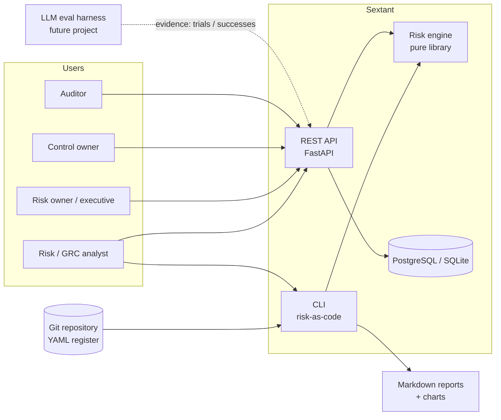
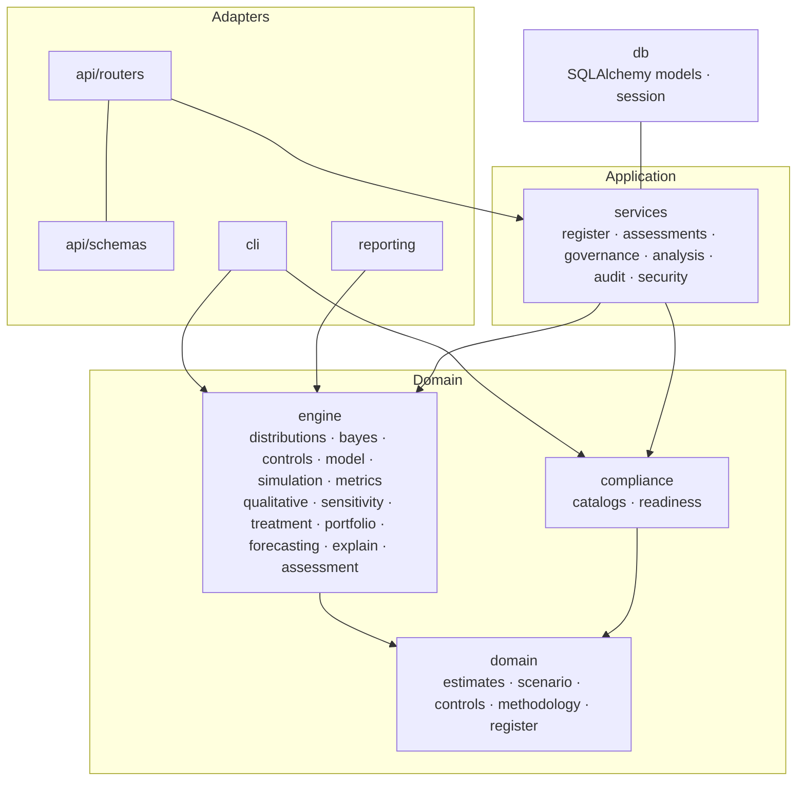
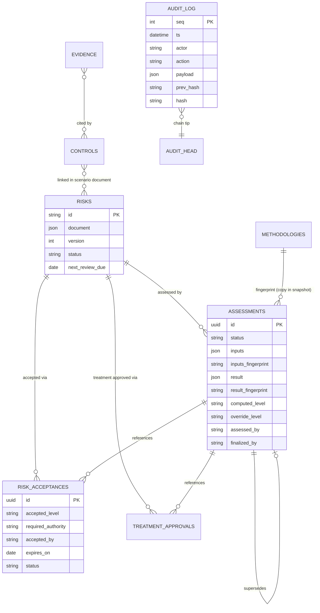
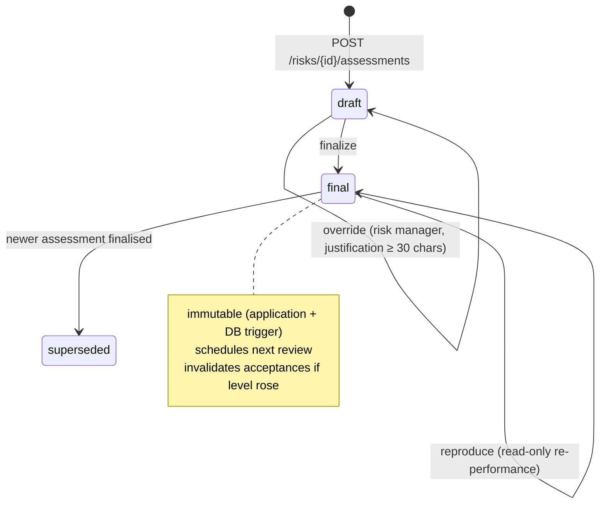
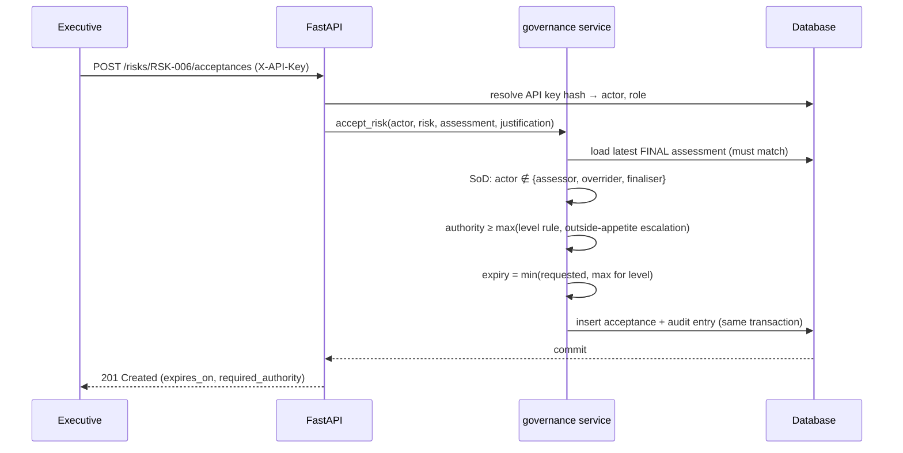
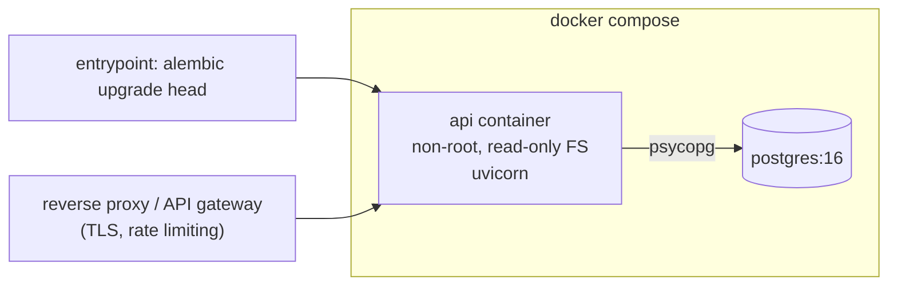

# Architecture

## 1. Context

Sextant has two front doors on one engine:

* **Risk-as-code (CLI).** The register lives as YAML in Git: reviewed in pull
  requests, versioned, diffable. `sextant report` produces a static,
  reproducible report set. This suits small teams and makes the whole method
  reviewable on GitHub.
* **Workflow service (API).** A multi-user register with roles, approvals,
  acceptances and an audit trail, which is the part a GRC tool must add around
  the maths.

## 2. Layers (ports and adapters)

| Package | Responsibility | Depends on |
|---|---|---|
| `domain` | Pydantic schemas: what a valid scenario, control, estimate, methodology or register *is* | pydantic only |
| `engine` | All mathematics. **Pure functions with no I/O, no database and no web code.** | domain, NumPy, SciPy |
| `compliance` | Framework catalogs (YAML) and readiness logic | domain, engine.controls |
| `services` | Use cases, permissions, governance rules, audit | domain, engine, compliance, db |
| `db` | Persistence (SQLAlchemy 2.0), sessions | — |
| `api` | HTTP: routing, (de)serialisation, error mapping, auth dependency | services |
| `cli`, `reporting` | Risk-as-code workflow and report generation | engine, compliance |

**Why this matters.** The engine can be reviewed, tested and re-used without a
server. That is how the statistical validation suite runs in seconds. The
governance rules live in *services*, so the API and any future UI cannot
bypass them.

## 3. Key design decisions

The full reasoning is in the ADRs in [`docs/adr/`](adr/).

| Decision | Choice | Alternative rejected |
|---|---|---|
| Decision basis for material risks | Quantitative (FAIR-aligned Monte Carlo) with the qualitative matrix retained | Matrix only (known ranking errors) |
| Prediction technique | Conjugate Bayesian and Monte Carlo methods | ML models (no data, not explainable) |
| Storage of domain objects | Validated JSON documents plus relational workflow tables | Fully normalised scenario tables (the schema would duplicate the Pydantic model and drift from it) |
| Comparing controls and treatments | Coupled simulation (thinning plus CRN) | Independent runs (noisy differences) |
| Audit trail | Append-only table, hash chain, DB triggers | Application logging (mutable, not evidential) |
| Authentication | Hashed API keys with RBAC | Session login or UI (out of scope); OIDC is on the roadmap |
| Deployment | One container plus PostgreSQL | Microservices, queues (unjustified at this scale) |

## 4. Data model

* A **risk** holds the current scenario definition (risk-as-code) with an
  optimistic-concurrency `version`.
* An **assessment** is an immutable result together with the *complete input
  snapshot* (scenario, referenced controls with their tests, methodology,
  as-of date, seed, trials). It can be reproduced even after the register has
  changed.
* **Acceptances** and **approvals** reference a specific final assessment.

## 5. Assessment lifecycle

## 6. Request flow (accepting a risk)

## 7. Cross-cutting concerns

| Concern | Implementation |
|---|---|
| Validation | Pydantic at every boundary (YAML, API, snapshots), `extra="forbid"`, semantic estimate checks, register cross-reference checks |
| Errors | Domain exceptions mapped centrally: 404 / 403 / 409 / 422, with a JSON body `{error, message}` and no stack traces |
| Transactions | One per request; the audit entry is written in the same transaction as the change |
| Concurrency | Optimistic versioning on risks; the audit chain head is row-locked (`SELECT … FOR UPDATE`) |
| Logging | structlog JSON with a request ID and the actor. Business events go to the audit log, not the application log. |
| Configuration | `SEXTANT_*` environment variables (pydantic-settings); there are no secrets in the repository |
| Resource limits | API trial cap, simulated-event budget |
| Reproducibility | Seeds, named streams, snapshot and fingerprints, engine and library versions, `uv.lock` |
| Time | UTC dates from a single clock module |

## 8. Deployment

The container binds to localhost in Compose. TLS termination, rate limiting and
SSO are expected in front of it (see [`SECURITY.md`](../SECURITY.md)).

## 9. Testing architecture

| Suite | Scope | Speed |
|---|---|---|
| `tests/unit` | Engine functions, schemas, compliance, CLI/reporting | seconds |
| `tests/validation` | Simulator against closed-form mathematics, property-based invariants | seconds |
| `tests/integration` | HTTP → services → migrated DB (SQLite locally, PostgreSQL 16 in CI) | seconds |
