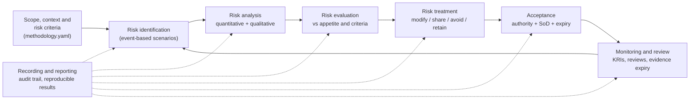
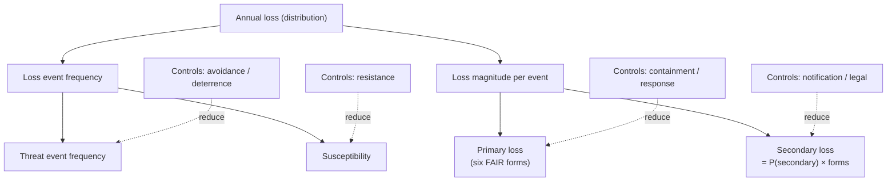

# Risk Methodology

This document specifies **how Sextant identifies, analyses, evaluates, treats,
accepts and monitors information-security risk**, and why each rule is the way
it is. The mathematics behind the quantitative model is in
[`STATISTICAL_METHODS.md`](STATISTICAL_METHODS.md), and the framework
relationships are in [`COMPLIANCE_MAPPING.md`](COMPLIANCE_MAPPING.md).

> Every number, threshold and weighting in this methodology is either
> (a) configuration in the versioned methodology file
> ([`default_methodology.yaml`](../src/sextant/domain/default_methodology.yaml)),
> (b) an input estimate with a recorded source and rationale, or
> (c) a formula documented here. There are no hidden constants.

---

## 1. Process overview (ISO 31000:2018 §6)

| ISO 31000 step | ISO/IEC 27001:2022 clause | Sextant implementation |
|---|---|---|
| Scope, context, criteria (6.3) | 6.1.2 a) establish risk criteria | `Methodology`: versioned, fingerprinted and approved (CTL-GOV-01) |
| Risk identification (6.4.2) | 6.1.2 c) | `Scenario` (ISO/IEC 27005 event-based approach) |
| Risk analysis (6.4.3) | 6.1.2 d) | Quantitative engine plus qualitative ratings |
| Risk evaluation (6.4.4) | 6.1.2 e) | `Evaluation`: level, ALE threshold, P(within appetite), authority |
| Risk treatment (6.5) | 6.1.3 a–e) | Treatment options compared on the same simulated years; draft SoA |
| Owner approval and acceptance | 6.1.3 f) | `TreatmentApproval`, `RiskAcceptance` with rules enforced in code |
| Monitoring and review (6.6) | 8.2, 9.1 | Review due dates, KRI forecasts, evidence and acceptance expiry |
| Recording and reporting (6.7) | 7.5, 8.2 (retain documented results) | Immutable assessments, audit chain, generated reports |

## 2. Terminology

| Term | Definition used in Sextant |
|---|---|
| **Risk scenario** | One threat event, caused by a threat source, exploiting one or more vulnerabilities, affecting assets and producing consequences. This is ISO/IEC 27005's event-based approach. |
| **Threat event frequency (TEF)** | Expected number of threat events per year that *could* cause loss (FAIR). |
| **Susceptibility** | Probability that a threat event becomes a loss event, *in the absence of the controls linked to the scenario*. FAIR calls it "vulnerability"; Sextant avoids that word here because it clashes with "a vulnerability" (a weakness). |
| **Loss event frequency (LEF)** | TEF × susceptibility × the product of the frequency-control multipliers. |
| **Loss magnitude** | Loss per loss event, split into the six FAIR loss forms: productivity, response, replacement, fines and judgments, competitive advantage, reputation. It is split into *primary* loss and *secondary* loss (losses caused by the reactions of stakeholders, which occur only with some probability). |
| **Inherent risk** | Risk **without the controls linked to the scenario**. The rest of the environment is left as it is. "Risk with no controls at all" is not a meaningful state, and practitioners use "inherent" inconsistently, so Sextant uses this explicit definition. |
| **Current risk** | Residual risk with the linked controls **as implemented and as tested**. |
| **Target risk** | Projected residual risk after the *selected* treatment option. |
| **Risk appetite** | The amount of risk the organisation is willing to pursue or retain: a per-scenario ALE threshold and a maximum acceptable level. |
| **Risk tolerance** | Acceptable variation around the objectives. It is expressed as a loss-exceedance tolerance curve for the portfolio, e.g. "at most a 5 % annual chance of losing ≥ €5M". |
| **Risk owner** | The accountable person (ISO/IEC 27001 6.1.2 c 2). Distinct from the *control owner*. |

## 3. Risk criteria: the methodology file

The methodology is **data**. A change creates a new version with a new SHA-256
fingerprint. Every assessment stores the fingerprint and a full copy of the
criteria, so it can always be traced to the criteria that were in force.

### 3.1 Likelihood scale: loss events per year

| Level | Name | Loss events / year | P(≥ 1 event in a year) |
|---|---|---|---|
| 1 | Very Low | < 0.05 | < 5 % |
| 2 | Low | 0.05 – 0.2 | 5 – 18 % |
| 3 | Moderate | 0.2 – 1 | 18 – 63 % |
| 4 | High | 1 – 5 | 63 – 99 % |
| 5 | Very High | ≥ 5 | > 99 % |

*Why frequency, not words?* "Likely" means different things to different
people. Frequency bands give every level a checkable meaning. The same bands
serve both the analyst's rating and the banding of quantitative results.

### 3.2 Impact scale: expected loss per event

Five financial bands (< €50k … ≥ €5M), each with non-financial descriptors
(operational, legal and regulatory, reputational) for qualitative rating. In
qualitative mode the overall impact is the **worst rated dimension**, not the
average. Averaging would let a severe regulatory consequence be diluted by
minor operational ones.

### 3.3 Risk matrix: a lookup, not a multiplication

The default matrix follows the structure of **NIST SP 800-30 Rev. 1, Appendix I,
Table I-2**. It is validated to be monotone: more likely or more severe can
never mean *lower* risk.

|  | I1 | I2 | I3 | I4 | I5 |
|---|---|---|---|---|---|
| **L5** | Very Low | Low | Moderate | High | Very High |
| **L4** | Very Low | Low | Moderate | High | Very High |
| **L3** | Very Low | Low | Moderate | Moderate | High |
| **L2** | Very Low | Low | Low | Low | Moderate |
| **L1** | Very Low | Very Low | Very Low | Low | Low |

The common alternative, multiplying the two ordinal ranks (L × I, 1–25), is
**computed but never used for decisions**. Ordinal numbers do not support
arithmetic. L2×I2 and L1×I4 get the same score, although their expected losses can
differ by an order of magnitude. Cox (2008) shows that matrices can even rank
risks in the wrong order. The register report shows a live example of this
disagreement from the example data.

### 3.4 Appetite, tolerance and acceptance authority

| Residual level | Minimum authority to accept | Max acceptance period | Review cycle |
|---|---|---|---|
| Very Low | Risk owner | 730 days | 365 days |
| Low | Risk owner | 365 days | 365 days |
| Moderate | Risk manager (2nd line) | 365 days | 180 days |
| High | Executive | 180 days | 90 days |
| Very High | Executive | 90 days | 30 days |

A scenario is **within appetite** only if both conditions hold:

1. its level is ≤ the maximum acceptable level (Moderate), **and**
2. its current ALE is ≤ the scenario ALE threshold (€500k).

Retaining a risk that is outside appetite *on either test* escalates the
required authority to `outside_appetite_authority` (Executive), whatever its
matrix level. This closes a well-known gap: a risk that a matrix rates "Low"
but that is expensive can otherwise be accepted by someone with too little
authority.

## 4. Risk identification

A good scenario is **specific enough to estimate**:

* **One threat event.** "Ransomware halts warehouse operations", not "cyber
  attack". If two parts of a scenario would have different frequencies or loss
  profiles, split it.
* **A threat source** typed by NIST SP 800-30 Appendix D: adversarial,
  accidental, structural, environmental.
* **Vulnerabilities and predisposing conditions** stated concretely. They
  explain *why* susceptibility has the value it has.
* **Assets** from the asset register (primary and supporting, ISO/IEC 27005),
  and the affected **security properties** (C, I, A).
* **A risk owner** who is accountable for the decision, not the analyst.

## 5. Risk analysis

### 5.1 Quantitative analysis (decision basis for material risks)

The FAIR-aligned decomposition:

**Every input is an estimate with provenance.** It is either an expert
estimate (a calibrated 90 % interval, or PERT min/mode/max) or a
**data-derived posterior**:

* incident history (`gamma_from_events`), e.g. 7 WMS outages in 5 years;
* trial data (`beta_from_trials`), e.g. 23 of 480 users submitting credentials
  in a phishing simulation, or 7 of 200 prompt-injection attempts succeeding in
  a red-team exercise.

Reports list every input with its distribution, provenance, source and
rationale, and state how many inputs are data-derived.

**Controls** act on a named factor. Their effect in each simulated year is:

$$e = \underbrace{r}_{\text{design reduction}} \times \underbrace{o}_{\text{operating rate}} \times \underbrace{c}_{\text{coverage}}, \qquad \text{factor} \leftarrow \text{factor} \times (1-e)$$

* **r (design reduction):** the proportional reduction when the control works
  as designed. This is an expert estimate that must be justified (`rationale`
  is mandatory, with at least 10 characters).
* **o (operating rate):** the probability the control works when needed. By
  default it is **derived from operating-effectiveness tests** (§6). An
  explicit estimate may override the tests, and the report then flags
  `CTL-OVERRIDE`.
* **c (coverage):** a measured fact, e.g. EDR is on 70 % of servers.

Several controls acting on the same factor combine multiplicatively
(independent layers of defence). This assumption is stated in every report
(see §12).

**Avoid double counting.** If an input was *measured with a control in place*,
that control must not be credited again. For example, phishing-simulation
susceptibility already reflects the awareness programme, and red-team results
already reflect the LLM guardrails. The example scenarios record this in their
`assumptions`.

### 5.2 Qualitative analysis

The analyst rates likelihood and each impact dimension from 1 to 5 for the
inherent, current and (optionally) target states. **Every rating requires a
rationale.** The level comes from the matrix lookup.

### 5.3 Banding quantitative results

Quantitative results are mapped onto the same scales:

* **likelihood** = band of the expected loss events per year;
* **impact** = band of the expected loss per loss event (all forms, with
  secondary loss probability-weighted).

The quantitative level is the **decision level**. If the analyst's qualitative
level differs by two or more levels, the finding `METHODS-DISAGREE` requires
the analyst to reconcile them.

### 5.4 Assessment-quality checks

These are automated checks that a second-line reviewer or auditor would
otherwise perform by hand:

| Code | Severity | Condition |
|---|---|---|
| `QUAL-UNSUPPORTED-REDUCTION` | error | Current rated below inherent, but no implemented control is linked |
| `QUAL-REDUCTION-UNEVIDENCED` | warning | A reduction is claimed, but no credited control is tested effective |
| `QUAL-CURRENT-ABOVE-INHERENT` | warning | Controls appear to *increase* risk |
| `CTL-UNTESTED` | info | A control is credited on the prior alone |
| `CTL-NOT-EFFECTIVE` | warning | A credited control failed operating tests |
| `CTL-OVERRIDE` | warning | An explicit operating-rate estimate overrides test evidence |
| `METHODS-DISAGREE` | warning | Qualitative and quantitative results differ by ≥ 2 levels |
| `INPUT-VERY-WIDE` | info | A 90 % range spans more than ×1000; consider decomposing it |
| `TRT-NONE-SELECTED` | info | Options exist but none is proposed |

## 6. Control assessment

Sextant separates **design effectiveness** (would the control work as
designed?) from **operating effectiveness** (did it work consistently over the
period?). This follows the ISAE 3402 / SOC 2 distinction between a test of
design (ToD) and a test of operating effectiveness (ToE).

* **Design test failed** → the control receives **no credit** in the current
  state.
* **Operating tests** within the look-back window (365 days) are pooled as an
  attribute sample: *n* samples and *k* exceptions. The operating rate becomes
  a Beta-Binomial posterior (uniform prior by default).
* **Conclusion rule** (statistical, for frequent or automated controls), with a
  tolerable deviation rate (TDR) of 10 % and 90 % confidence:
  * *effective* if P(deviation ≤ TDR) ≥ 90 %
  * *not effective* if P(deviation > TDR) ≥ 90 %
  * *inconclusive* otherwise. The report states how many further clean samples
    would be needed.

  With zero exceptions, this requires 21 samples. The classical audit plan
  requires 22. The report prints the Clopper-Pearson bound alongside the
  Bayesian result for auditors who expect it.
* **Low-frequency controls** (annual, quarterly, monthly, weekly) cannot produce
  statistical samples. For these, the audit convention applies: a minimum
  judgemental sample (annual 1, quarterly 2, monthly 2, weekly 5), and any
  exception is a deficiency. The *risk model still uses the posterior*, so the
  thin evidence stays visible in the numbers. For example, 2 clean samples give
  a mean operating rate of 75 %, not 100 %.
* **Untested controls** keep the prior, Beta(1, 1), with mean 50 %. They
  receive uncertain, partial credit, and sensitivity analysis typically flags
  them as a top driver. That tells the organisation where testing has the most
  value.

## 7. Risk evaluation

For each scenario the `Evaluation` records the following:

* the decision level (quantitative) and the qualitative level;
* whether the ALE is within the threshold, **and the probability that the true
  ALE is within the threshold** given the parameter uncertainty (the share of
  parameter draws with E[L | θ] ≤ threshold). A point estimate just below the
  threshold with only a 55 % probability of really being below it is a
  different decision from one with 95 %.
* whether treatment is required, the acceptance authority required, the maximum
  acceptance period and the review cycle.

## 8. Risk treatment

| Option (ISO/IEC 27005 §8.2) | How it is modelled |
|---|---|
| **Modify** | Add controls (`add_controls`) or improve existing ones (`change_controls`: coverage, operating rate) |
| **Share** | Per-occurrence insurance: `recovery = min(max(insurable − deductible, 0), limit)`. Fines are excluded by default. *Accountability is not transferred.* |
| **Avoid** | Stop the activity. The loss event frequency is set to zero, and the cost is the lost benefit. |
| **Retain** | No change. This leads to the acceptance workflow. |

All options are simulated on **the same simulated years** as the current state
(common random numbers). Each option reports:

* ALE, VaR95 and ES95, and their reductions. The ALE reduction is reported with
  its paired standard error, and with the standard error that independent runs
  would have given, to show the variance reduction.
* the annualised cost (`annual + one-time / amortisation years`), the net
  benefit and ROSI;
* the residual level and whether it is within appetite.

**ROSI is not the decision rule.** An option with negative ROSI can still be
right, for example to meet a regulatory obligation, to cut the tail (ΔES) or
to reach appetite. An option with high ROSI can still be wrong: insurance can
have an excellent ROSI but does not reduce the likelihood of disruption. The
selected option (`selected_treatment`) defines the target state. The **risk
owner approves the plan** (ISO/IEC 27001 6.1.3 f), subject to segregation of
duties.

## 9. Acceptance and governance rules (enforced in code)

1. **Authority**: the acceptor's role must be at least the required authority
   (§3.4, with escalation outside appetite).
2. **Segregation of duties**: whoever prepared, overrode or finalised the
   assessment cannot accept its residual risk or approve its treatment. The
   administrator role has *no* acceptance authority.
3. **Specificity**: an acceptance references one *final* assessment, and it
   must be the latest one.
4. **Time limit**: the requested duration is capped at the maximum for the
   level.
5. **Automatic invalidation**: finalising a new assessment with a *higher*
   level invalidates active acceptances.
6. **Overrides**: a risk manager may replace the computed level on a *draft*
   with a justification of at least 30 characters. The computed level, the
   override, who made it, when and why are all kept.
7. **Immutability**: finalised assessments cannot be changed. The application
   refuses, and so do database triggers.

## 10. Monitoring and review

* **Periodic review**: `next_review_due = as_of + review cycle` for the
  assessed level. The monitoring endpoint lists reviews that are due or
  overdue.
* **Acceptance expiry** and **evidence expiry**: evidence past `valid_until`
  stops counting towards readiness. Controls that rely on it are flagged.
* **KRIs**: incident and KRI series are forecast with predictive intervals,
  trend-tested and backtested ([`STATISTICAL_METHODS.md` §10](STATISTICAL_METHODS.md#10-forecasting-kris-and-incident-counts)).
  A KRI trending towards its threshold is a trigger for reassessment.
* **Reassessment triggers**: a significant incident, a failed control test, a
  material change to an asset, a threshold breach, or a new threat
  intelligence estimate.

## 11. Recording and reporting (auditability)

Each assessment retains the following:

* **Who and when**: assessed by, finalised by, override by, and timestamps.
* **Inputs snapshot**: the scenario, the referenced controls with their full
  test history, the methodology, the as-of date, the seed and the trials.
* **Results**, with SHA-256 fingerprints of inputs and results, the engine
  version and the library versions.
* **Assumptions**: the model-level assumptions plus the scenario-specific ones,
  and the model notes (which controls were or were not credited, and why).

Every change is appended to the hash-chained audit log in the same transaction.
The auditor's **re-performance test** is `POST /assessments/{id}/reproduce`: it
recomputes the result from the snapshot and compares the fingerprints.

## 12. Assumptions and limitations

| Assumption | Effect if wrong | Mitigation |
|---|---|---|
| Loss events are Poisson given the rate | Clustered events (campaigns) are under-dispersed in the model | Model at campaign level; the epistemic uncertainty on TEF already widens the tails |
| Controls on the same factor act independently | Overstates the combined reduction when failures are correlated (e.g. a shared identity plane) | Leave-one-out and stress tests; a copula between controls is on the roadmap |
| Scenarios aggregate independently | Understates the portfolio tail | Stated in the portfolio report; a common-shock model is on the roadmap |
| Lognormal severities | Real cyber losses can be heavier-tailed | Caps where a hard limit exists; VaR99 and ES99 are labelled as sensitive |
| Expert estimates are calibrated | Overconfident experts give intervals that are too narrow | Provenance is shown; calibration tracking is on the roadmap |
| Red-team and simulation data represent real attacks | Adaptive attackers may do better | Stated in the assumptions of the scenario |

## 13. What this methodology does *not* do

* It does not certify or declare compliance (see
  [`COMPLIANCE_MAPPING.md`](COMPLIANCE_MAPPING.md)).
* It does not replace judgement. It makes judgement explicit, testable and
  attributable.
* It does not predict individual incidents. It estimates frequencies and
  distributions and states their uncertainty.

## References

ISO 31000:2018; ISO/IEC 27001:2022; ISO/IEC 27005:2022; NIST SP 800-30 Rev. 1;
NIST SP 800-37 Rev. 2; The Open Group O-RT / O-RA (FAIR); Cox, L. A. (2008),
*What's Wrong with Risk Matrices?*; Hubbard & Seiersen, *How to Measure
Anything in Cybersecurity Risk*; AICPA *Audit Guide: Audit Sampling*.
