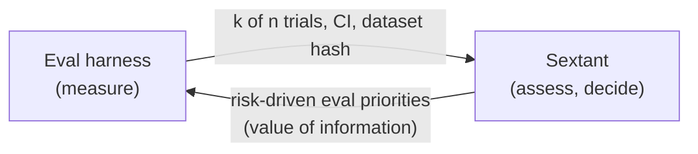

# Proposal: a separate LLM evaluation and assurance repository

**Status:** proposal for a second portfolio project. The reasoning for keeping
it separate is in ADR 0006.

## 1. Why a separate project

| | Sextant (risk register) | LLM evaluation harness |
|---|---|---|
| Question | Which risks matter, how large are they, who decides? | How does this AI system behave, measurably? |
| Users | GRC, risk owners, auditors | ML engineers, AI assurance, red teams, model risk |
| Core method | Risk analysis (frequency × severity, uncertainty) | Test design, metrics, statistical comparison, judge calibration |
| Architecture | Register, workflow, audit trail | Datasets, prompt/version control, model adapters, runners, result store |
| Governance anchor | ISO 31000 / 27005, NIST CSF | NIST AI RMF **MEASURE**, ISO/IEC 42001 Annex A, EU AI Act (Art. 9, 15) |

Putting both in one repository would weaken both. **Integrating them through
evidence** shows the full AI-governance chain:



## 2. Proposed name and concept

**`calipers`**: evidence-grade evaluation of LLM applications for AI assurance.
It produces statistically defensible, versioned evaluation results that can be
cited as audit evidence.

## 3. Scope (MVP)

1. **Evaluation suites as code.** Test cases in YAML/JSONL with provenance,
   licence and a content hash. Suites cover:
   * security: prompt injection (direct and indirect), data exfiltration,
     tool-call abuse;
   * reliability: grounded QA with confabulation checks against reference
     documents;
   * policy: PII leakage and refusal of disallowed content.
2. **Adapters** for the system under test. This is the *application*,
   including its retrieval and tools, not only the model.
3. **Scoring.** Deterministic checks first (regex/PII detectors, exact or
   semantic match against references). LLM-as-judge only where necessary, and
   **calibrated against human labels** (Cohen's κ / Krippendorff's α reported).
4. **Statistics.**
   * Proportions with Wilson or Beta intervals, not bare percentages.
   * Paired comparison of two model or prompt versions on the same items
     (McNemar or a paired bootstrap), with power and sample-size planning:
     "how many attacks do we need to show the rate is below 1 %?".
   * Multiple-comparison control across metrics (Holm).
   * Drift monitoring between releases.
5. **Evidence export.** A signed JSON record with the suite hash, system
   version, run environment, `successes`/`trials` and the interval. Sextant
   imports it directly as a `beta_from_trials` estimate.
6. **Mapping** of each metric to NIST AI RMF MEASURE subcategories and the NIST
   AI 600-1 (Generative AI Profile) risk categories.

## 4. What it would demonstrate

* The **measurement** side of AI governance (AI RMF MEASURE; ISO/IEC 42001
  performance evaluation), complementing Sextant's **manage and decide** side.
* Experimental design and statistical testing, where many evaluation projects
  stop at leaderboards.
* Understanding that the evaluation target is the *system*: the model plus
  prompts, retrieval, tools and guardrails.

## 5. Out of scope

Training or fine-tuning models, benchmark leaderboards, and generic chatbot
UIs.

## 6. Integration contract (draft)

```json
{
  "suite": {"id": "prompt-injection-v3", "sha256": "…", "items": 200},
  "system": {"name": "customer-assistant", "version": "2026.08.2", "guardrails": "CTL-AI-01@v5"},
  "result": {"successes": 7, "trials": 200, "interval_95": [0.014, 0.071]},
  "run": {"date": "2026-08-28", "operator": "ai-assurance", "environment": "staging-mirror"},
  "maps_to": ["nist_ai_rmf_1_0:MEASURE-2"]
}
```

Sextant turns this into `{dist: beta_from_trials, successes: 7, trials: 200,
source: "calipers run …"}` for the susceptibility of RSK-008. The evidence
digest goes into the evidence register.
