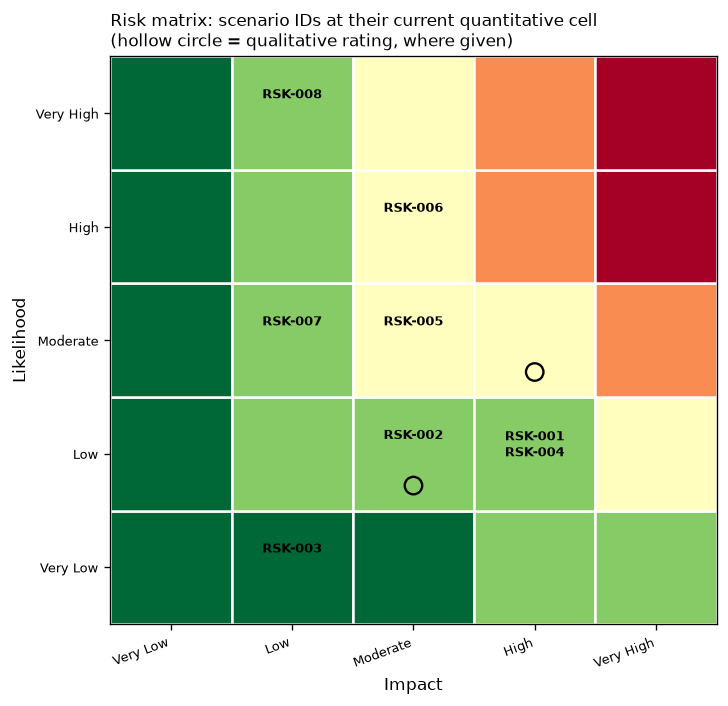
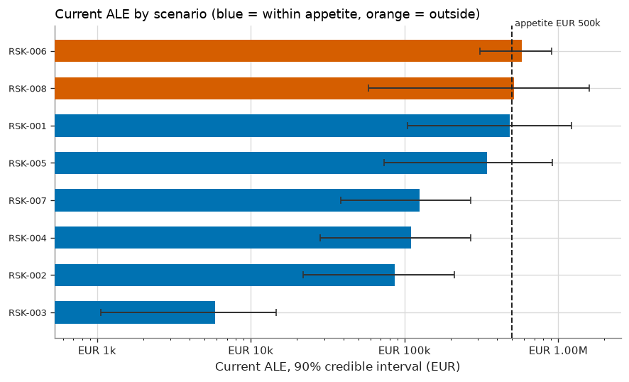
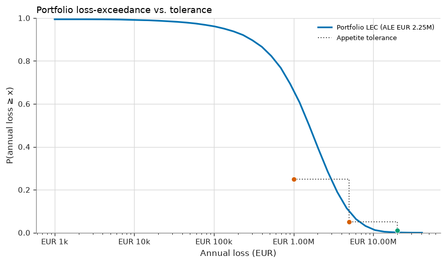

# Sextant risk register — Halcyon Logistics S.A. (fictional)

> **FICTIONAL organisation.** Halcyon Logistics S.A. (fictional), its figures and its incidents are synthetic and used only to
> demonstrate Sextant. They are not benchmarks and describe no real entity.

Mid-sized EU freight-forwarding and contract-logistics company. About 1,100 employees, 14 warehouses, a customer shipment-tracking portal, and a new LLM-based customer-service assistant. Assumed to fall within NIS2 scope (transport sector) and GDPR.

| | |
|---|---|
| **Sector / jurisdiction** | Transport and logistics / EU member state (illustrative) |
| **As of** | 2026-09-01 |
| **Methodology** | `sextant-reference` v1.0.0 (fingerprint `af488897ff9d…`) |
| **Engine version** | 1.0.0 |
| **Simulation** | 20,000 trials per scenario, seed 20260101 |
| **Currency** | EUR |

## How to read this report

Every scenario below has **three risk states**: *inherent* (without the linked controls), *current*
(residual risk with controls as implemented and tested), and, where a treatment is selected, *target*
(projected residual risk after that treatment). The **quantitative level** is the primary decision basis: a
Monte Carlo simulation of annual loss, banded onto the methodology's likelihood/impact scale. The
**qualitative level**, where an analyst also rated the scenario, is kept for communication and as a
consistency check — see [Matrix vs quantitative ranking](#matrix-vs-quantitative-ranking) below for where
the two disagree. "Within appetite" combines two tests: the scenario's expected annual loss (ALE) must be at
or below the methodology's per-scenario threshold, **and** its quantitative level must be at or below the
maximum acceptable level. Each scenario's full detail, including its assumptions and how to reproduce the
numbers, is in `risks/<ID>.md`.

## Register

| ID | Title | Owner | Quant. level | Qual. level | Current ALE | 90% credible interval | VaR 95% | P(ALE within appetite) | Within appetite | Acceptance authority | Selected treatment | Target ALE |
|---|---|---|---|---|---|---|---|---|---|---|---|---|
| [RSK-001](risks/RSK-001.md) | Ransomware halts warehouse operations | Chief Operating Officer | Low | Moderate | EUR 485k | EUR 105k – EUR 1.22M | EUR 3.23M | 67% | ✅ | Risk Owner | EDR on all servers with 24/7 managed detection and response | EUR 315k |
| [RSK-002](risks/RSK-002.md) | Compromise of an administrator account exposes customer data | Head of IT Infrastructure | Low | — | EUR 86k | EUR 22k – EUR 212k | EUR 553k | 100% | ✅ | Risk Owner | Phishing-resistant MFA (FIDO2) for all administrators | EUR 52k |
| [RSK-003](risks/RSK-003.md) | Payroll SaaS provider breach exposes employee data | HR Director | Very Low | — | EUR 6k | EUR 1k – EUR 15k | EUR 0 | 100% | ✅ | Risk Owner | Retain within appetite; review at contract renewal | EUR 6k |
| [RSK-004](risks/RSK-004.md) | Misconfigured cloud storage exposes customs documents | Head of IT Infrastructure | Low | — | EUR 111k | EUR 28k – EUR 271k | EUR 372k | 100% | ✅ | Risk Owner | Organisation-level guardrail blocking public storage | EUR 11k |
| [RSK-005](risks/RSK-005.md) | Departing employee exfiltrates customer and pricing data | Chief Commercial Officer | Moderate | Low | EUR 346k | EUR 73k – EUR 915k | EUR 1.60M | 80% | ✅ | Risk Manager | Test DLP operation and extend it to personal cloud uploads | EUR 255k |
| [RSK-006](risks/RSK-006.md) | Prolonged warehouse management system outage | Head of Logistics IT | Moderate | — | EUR 578k | EUR 309k – EUR 903k | EUR 1.99M | 39% | ❌ | Executive | Retain and restore the annual failover test | EUR 578k |
| [RSK-007](risks/RSK-007.md) | Late or deficient regulatory incident notification | General Counsel | Low | — | EUR 125k | EUR 39k – EUR 268k | EUR 642k | 100% | ✅ | Risk Owner | Automated notification workflow and quarterly drills | EUR 81k |
| [RSK-008](risks/RSK-008.md) | LLM assistant discloses other customers' shipment data via prompt injection | Head of Digital | Low | — | EUR 515k | EUR 58k – EUR 1.60M | EUR 2.34M | 68% | ❌ | Executive | Least-privilege retrieval enforced outside the model | EUR 38k |

## Portfolio

The portfolio aggregates every scenario's **current-state** simulated annual loss, trial by trial.

| Metric | Value |
|---|---|
| ALE | EUR 2.25M |
| Median annual loss | EUR 1.56M |
| VaR 95% | EUR 6.66M |
| Expected shortfall 95% | EUR 9.68M |
| VaR 99% | EUR 11.16M |
| Expected shortfall 99% | EUR 15.20M |
| Sum of standalone VaR 95% | EUR 10.73M |
| Within tolerance | ❌ no |

**Independence assumption:** Scenarios are aggregated as independent; correlated losses would widen the tail. Each scenario is evaluated in its current (as-implemented, as-tested) control state.

### Tolerance curve

| Loss threshold | Max probability (appetite) | Simulated probability | 95% MC interval | Status |
|---|---|---|---|---|
| EUR 1.00M | 25% | 66.3% | 65.6% – 66.9% | exceeds |
| EUR 5.00M | 5% | 9.8% | 9.4% – 10.2% | exceeds |
| EUR 20.00M | 1% | 0.1% | 0.1% – 0.2% | within |

### Scenario shares

Two decompositions, because they answer different questions: **ALE share** drives the annual security
budget; **tail share** (Euler allocation of the 95% expected shortfall) drives capital, insurance and board
appetite. A scenario with frequent small losses can dominate the first without dominating the second, and a
rare, severe scenario can be the reverse.

| Scenario | ALE | ALE share | Standalone VaR 95% | Tail contribution (ES 95%) | Tail share |
|---|---|---|---|---|---|
| [RSK-001](risks/RSK-001.md) Ransomware halts warehouse operations | EUR 485k | 21.5% | EUR 3.23M | EUR 4.62M | 47.7% |
| [RSK-008](risks/RSK-008.md) LLM assistant discloses other customers' shipment data via prompt injection | EUR 515k | 22.9% | EUR 2.34M | EUR 1.95M | 20.1% |
| [RSK-006](risks/RSK-006.md) Prolonged warehouse management system outage | EUR 578k | 25.7% | EUR 1.99M | EUR 969k | 10.0% |
| [RSK-005](risks/RSK-005.md) Departing employee exfiltrates customer and pricing data | EUR 346k | 15.4% | EUR 1.60M | EUR 819k | 8.5% |
| [RSK-004](risks/RSK-004.md) Misconfigured cloud storage exposes customs documents | EUR 111k | 4.9% | EUR 372k | EUR 760k | 7.8% |
| [RSK-007](risks/RSK-007.md) Late or deficient regulatory incident notification | EUR 125k | 5.6% | EUR 642k | EUR 329k | 3.4% |
| [RSK-002](risks/RSK-002.md) Compromise of an administrator account exposes customer data | EUR 86k | 3.8% | EUR 553k | EUR 236k | 2.4% |
| [RSK-003](risks/RSK-003.md) Payroll SaaS provider breach exposes employee data | EUR 6k | 0.3% | EUR 0 | EUR 6k | 0.1% |

## Charts

## Matrix vs quantitative ranking

The 1–5 × 1–5 risk matrix is useful for communication, but multiplying two ordinal ranks is not arithmetic:
the same product can hide expected losses that differ by an order of magnitude (*range compression*), and a
higher product can even sit on a *lower* expected loss than a lower product (*ranking reversal*; Cox, 2008).
The table below ranks scenarios by current ALE and shows, alongside, the ordinal likelihood × impact score
that the classic matrix approach would rank by instead.

| Rank by ALE | Scenario | Current ALE | Quantitative level | Ordinal score (L×I) | Qualitative level | Within appetite |
|---|---|---|---|---|---|---|
| 1 | [RSK-006](risks/RSK-006.md) Prolonged warehouse management system outage | EUR 578k | Moderate | 12 | — | ❌ |
| 2 | [RSK-008](risks/RSK-008.md) LLM assistant discloses other customers' shipment data via prompt injection | EUR 515k | Low | 10 | — | ❌ |
| 3 | [RSK-001](risks/RSK-001.md) Ransomware halts warehouse operations | EUR 485k | Low | 8 | Moderate | ✅ |
| 4 | [RSK-005](risks/RSK-005.md) Departing employee exfiltrates customer and pricing data | EUR 346k | Moderate | 9 | Low | ✅ |
| 5 | [RSK-007](risks/RSK-007.md) Late or deficient regulatory incident notification | EUR 125k | Low | 6 | — | ✅ |
| 6 | [RSK-004](risks/RSK-004.md) Misconfigured cloud storage exposes customs documents | EUR 111k | Low | 8 | — | ✅ |
| 7 | [RSK-002](risks/RSK-002.md) Compromise of an administrator account exposes customer data | EUR 86k | Low | 6 | — | ✅ |
| 8 | [RSK-003](risks/RSK-003.md) Payroll SaaS provider breach exposes employee data | EUR 6k | Very Low | 2 | — | ✅ |

**Range compression:** RSK-001 and RSK-004 share the same ordinal score (8 = likelihood × impact), yet their current ALE differs by a factor of 4.4 (EUR 485k vs EUR 111k); the ordinal score cannot tell these risks apart even though the model can.
**Ranking reversal:** RSK-001 has a lower ordinal score (8) than RSK-005 (9) but a higher current ALE (EUR 485k vs EUR 346k); a committee that prioritised by the ordinal score alone would treat the smaller risk first (Cox, 2008).
**Appetite is set on ALE, not on the matrix level:** RSK-006 is rated 'Moderate' on the risk matrix, which alone would not prompt escalation, but its current ALE of EUR 578k exceeds the EUR 500k scenario appetite threshold and is therefore outside appetite.

## Findings

Automated assessment-quality checks (the kind a second-line reviewer or auditor would raise), across all
scenarios:

| Scenario | Severity | Code | Message |
|---|---|---|---|
| [RSK-001](risks/RSK-001.md) | warning | `CTL-NOT-EFFECTIVE` | CTL-VUL-01 tested NOT effective (6/30 exceptions); its reduced credit is reflected, but remediation should be tracked. |
| [RSK-001](risks/RSK-001.md) | warning | `CTL-NOT-EFFECTIVE` | CTL-BKP-01 tested NOT effective (1/12 exceptions); its reduced credit is reflected, but remediation should be tracked. |
| [RSK-002](risks/RSK-002.md) | warning | `CTL-NOT-EFFECTIVE` | CTL-IAM-02 tested NOT effective (1/25 exceptions); its reduced credit is reflected, but remediation should be tracked. |
| [RSK-005](risks/RSK-005.md) | warning | `CTL-NOT-EFFECTIVE` | CTL-IAM-02 tested NOT effective (1/25 exceptions); its reduced credit is reflected, but remediation should be tracked. |
| [RSK-005](risks/RSK-005.md) | warning | `QUAL-REDUCTION-UNEVIDENCED` | Risk reduction is claimed, but none of the credited controls is tested effective. |
| [RSK-005](risks/RSK-005.md) | info | `CTL-UNTESTED` | CTL-DLP-01 is credited without operating-effectiveness evidence (prior only). |
| [RSK-006](risks/RSK-006.md) | info | `CTL-UNTESTED` | CTL-DR-01 is credited without operating-effectiveness evidence (prior only). |

## Compliance readiness

Each scenario's linked controls are also mapped to external frameworks. Readiness is a planning indicator,
not a conformity assessment — see the disclaimer below.

| Framework | Readiness (addressed / applicable) | Coverage | Report |
|---|---|---|---|
| ISO/IEC 27001:2022 | 2.6% | 16.2% | [readiness/iso27001_2022.md](readiness/iso27001_2022.md) |
| NIST Cybersecurity Framework 2.0 | 2.8% | 14.2% | [readiness/nist_csf_2_0.md](readiness/nist_csf_2_0.md) |
| NIS2 Directive (EU) 2022/2555 - selected articles | 0.0% | 57.1% | [readiness/nis2_2022_2555.md](readiness/nis2_2022_2555.md) |
| NIST AI Risk Management Framework 1.0 (category level) | 0.0% | 26.3% | [readiness/nist_ai_rmf_1_0.md](readiness/nist_ai_rmf_1_0.md) |

A draft Statement of Applicability for ISO/IEC 27001:2022 Annex A is at
[readiness/soa-iso27001_2022.md](readiness/soa-iso27001_2022.md).

> Readiness indicators summarise mapped controls, test results and evidence currency. They are NOT an audit opinion, a conformity assessment or a certification. Mapping relationships reflect analyst judgement (NIST IR 8477 set-theory relationships) and should be reviewed by the compliance function.