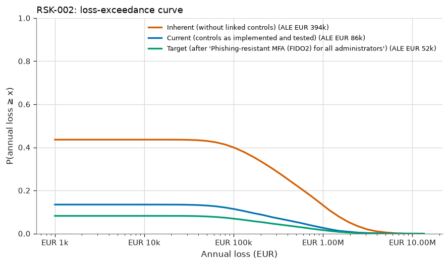
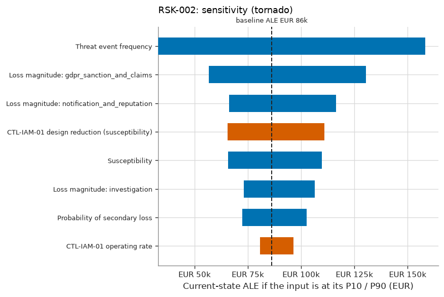

# RSK-002 — Compromise of an administrator account exposes customer data

RSK-002 Compromise of an administrator account exposes customer data: current risk 'Low', ALE EUR 86k (90% CI EUR 22k–EUR 212k), within appetite.

## What is the estimated risk?

The current expected annual loss (ALE) is EUR 86k, with a 90% credible interval of EUR 22k to EUR 212k. The probability of at least one loss event in a year is 13%. In a 1-in-20 bad year, losses reach EUR 553k or more (VaR 95%). The average of those worst 5% of years is EUR 1.36M (expected shortfall).

## Why is it at this level?

0.149 expected loss events/yr → likelihood 'Low'; EUR 581,936 expected loss per event → impact 'Moderate'. The risk matrix gives 'Low'. The ALE of EUR 86k is compared with the scenario threshold of EUR 500k, and the level with the maximum acceptable level 'Moderate'. The risk is **within appetite**. Given the parameter uncertainty, the probability that the true ALE is within the threshold is 100%.

## How confident are we?

The ALE credible interval spans a factor of 9.7. 3 of 11 inputs are data-derived; the rest are expert judgement or assumptions. The largest single source of uncertainty in the ALE is Threat event frequency (rank correlation +0.87), so better measurement of this input would narrow the estimate most. 1 of the 2 controls credited today are tested effective. The Monte Carlo error on the ALE is ±EUR 3k (20,000 trials). This is simulation precision only and does not reflect input uncertainty.

## Which controls reduce it?

The linked controls, as implemented and tested, reduce the ALE from EUR 394k (inherent) to EUR 86k, a reduction of 78%. The most critical controls are CTL-IAM-01 (+EUR 290k if it failed), CTL-IAM-02 (+EUR 4k if it failed).

## What if the assumptions change?

The main drivers, each moved from its P10 to its P90, are Threat event frequency (EUR 33k–EUR 158k), Loss magnitude: gdpr_sanction_and_claims (EUR 57k–EUR 130k), Loss magnitude: notification_and_reputation (EUR 66k–EUR 116k). Stress tests: TEF ×2: ALE EUR 180k (+108%), level 'Moderate'; Magnitude ×2: ALE EUR 172k (+100%), level 'Low'; CTL-IAM-01 fails: ALE EUR 376k (+336%), level 'Moderate'; CTL-IAM-02 fails: ALE EUR 91k (+5%), level 'Low'.

## What mitigation has the greatest effect?

The largest risk reduction comes from option T1 'Phishing-resistant MFA (FIDO2) for all administrators': ALE −EUR 34k (±EUR 2k, paired estimate), VaR95 −EUR 320k. Its annualised cost is EUR 28k (ROSI +21%), and the residual level would be 'Low'. The selected treatment gives a target ALE of EUR 52k ('Low').

## What assumptions were made?

- Loss events follow a Poisson process given the annual rate (events are independent in time).
- Controls acting on the same factor combine multiplicatively (independent layers of defence).
- A control's operating rate is the probability it works for a given event; failures are independent between events.
- Loss forms of the same event are positively correlated through a one-factor Gaussian copula.
- Loss-magnitude ranges describe event-to-event variability; uncertainty about severity parameters is not modelled separately (v1).
- Inherent risk is the risk without the controls linked to the scenario; the wider environment is unchanged.
- Quantitative banding: likelihood from expected loss events per year, impact from expected loss per event.
- Susceptibility is measured with the awareness programme in place, so CTL-AWR-01 is not credited separately (this avoids double counting).

## Risk states

| State | ALE | 90% credible interval | VaR 95% | ES 95% | P(≥ 1 event) | Loss events/yr | Expected loss/event | Level (L×I) |
|---|---|---|---|---|---|---|---|---|
| Inherent (without linked controls) | EUR 394k | EUR 110k – EUR 946k | EUR 2.00M | EUR 3.28M | 44% | 0.65 | EUR 611k | Moderate (3×3) |
| Current (controls as implemented and tested) | EUR 86k | EUR 22k – EUR 212k | EUR 553k | EUR 1.36M | 13% | 0.15 | EUR 582k | Low (2×3) |
| Target (after 'Phishing-resistant MFA (FIDO2) for all administrators') | EUR 52k | EUR 10k – EUR 132k | EUR 233k | EUR 957k | 8% | 0.09 | EUR 582k | Low (2×3) |



## Loss breakdown by loss form (current state)

| Loss form | Mean annual amount | Share of ALE |
|---|---|---|
| Fines Judgments | EUR 35k | 40.4% |
| Reputation | EUR 26k | 30.2% |
| Response | EUR 19k | 22.6% |
| Productivity | EUR 6k | 6.8% |

## Inputs

| Input | Distribution | Provenance | Source | Rationale |
|---|---|---|---|---|
| Threat event frequency | lognormal (median 10.95, 90% range 4–30) | Expert Judgement | Email-security telemetry 2025-2026 | Targeted credential-phishing campaigns per year that reach administrators. |
| Susceptibility | Beta(24, 458), mean 0.050, 90% CI 0.035–0.067 [posterior from 23/480 observed] | Data | Phishing simulation Q2 2026 (EV-004) | Share of recipients who submitted credentials, measured with the awareness programme in place. |
| Probability of secondary loss | PERT (min 0.3, most likely 0.5, max 0.8) | Expert Judgement | — | Likelihood that admin misuse leads to a notifiable exfiltration of personal data. |
| Loss magnitude: investigation | lognormal (median 1.095e+05, 90% range 3e+04–4e+05) | Expert Judgement | — | — |
| Loss magnitude: service_disruption | PERT (min 5,000, most likely 3e+04, max 1.5e+05) | Expert Judgement | — | — |
| Loss magnitude: gdpr_sanction_and_claims | lognormal (median 2.739e+05, 90% range 5e+04–1.5e+06) | Expert Judgement | — | — |
| Loss magnitude: notification_and_reputation | lognormal (median 2.236e+05, 90% range 5e+04–1e+06) | Expert Judgement | — | — |
| CTL-IAM-01 design reduction (susceptibility) | PERT (min 0.7, most likely 0.9, max 0.98) | Expert Judgement | — | MFA defeats replay of stolen passwords; push fatigue remains possible; legacy admin accounts (10%) are excluded. |
| CTL-IAM-01 operating rate | Beta(41, 1), mean 0.976, 90% CI 0.930–0.999 [control tests: 0 exceptions in 40 samples] | Data | control tests | coverage 90% |
| CTL-IAM-02 design reduction (primary loss) | PERT (min 0.05, most likely 0.15, max 0.3) | Expert Judgement | — | Fewer standing privileges limit what a compromised administrator can reach. |
| CTL-IAM-02 operating rate | Beta(25, 2), mean 0.926, 90% CI 0.830–0.986 [control tests: 1 exceptions in 25 samples] | Data | control tests | coverage 100% |

## Control assessment

| Control | Conclusion | Basis | Samples | Exceptions | Posterior mean operating rate | 90% interval | Clopper-Pearson upper bound | ALE increase if it failed |
|---|---|---|---|---|---|---|---|---|
| CTL-IAM-01 MFA for remote, cloud and privileged access | Effective | statistical | 40 | 0 | 97.6% | 93.0% – 99.9% | 5.6% | EUR 290k |
| CTL-IAM-02 Quarterly privileged access review | Not Effective | judgemental (frequency-based) | 25 | 1 | 92.6% | 83.0% – 98.6% | 14.7% | EUR 4k |

<details>
<summary>Control assessment detail</summary>

- **CTL-IAM-01**: 0 exception(s) in 40 samples. The posterior mean operating rate is 97.6%. P(deviation rate ≤ 10%) = 98.7% against a required 90%. Conclusion: effective. Classical 90% upper bound on the deviation rate: 5.6%.
- **CTL-IAM-02**: Quarterly control: 1 exception(s) in 25 samples (audit convention: at least 2 samples and no exceptions). Conclusion: not effective. The risk model still uses the posterior operating rate (mean 93%), which reflects how little a small sample proves.

</details>

## Treatment options

Effects are compared against the current state **on the same simulated years** (common random numbers), so
the paired standard error is smaller than the independent one; both are shown to make that precision gain
visible.

| Option | Type | ALE | ΔALE (paired SE) | ΔALE independent SE | ΔVaR 95% | Annualised cost | ROSI | Residual level | Within appetite |
|---|---|---|---|---|---|---|---|---|---|
| T1 Phishing-resistant MFA (FIDO2) for all administrators | Modify | EUR 52k | +EUR 34k (±EUR 2k) | ±EUR 3k | +EUR 320k | EUR 28k | +21% | Low | ✅ |

## Sensitivity



Rank sensitivity: the Spearman correlation between each epistemic input's draw and the trial's conditional
expected loss, which ranks where better measurement would narrow the ALE estimate the most (top
7 shown).

| Input | Spearman ρ | Share of explained variance |
|---|---|---|
| Threat event frequency | +0.87 | 79.5% |
| CTL-IAM-01 design reduction (susceptibility) | -0.28 | 8.1% |
| Susceptibility | +0.28 | 8.0% |
| Probability of secondary loss | +0.18 | 3.2% |
| CTL-IAM-01 operating rate | -0.11 | 1.2% |
| CTL-IAM-02 design reduction (primary loss) | -0.02 | 0.0% |
| CTL-IAM-02 operating rate | +0.01 | 0.0% |

## Stress tests

Named what-if scenarios, re-simulated on the same random numbers as the current state.

| Stress | Description | ALE | Change vs. current ALE | VaR 95% | Resulting level |
|---|---|---|---|---|---|
| TEF ×2 | Threat event frequency doubles. | EUR 180k | +108% | EUR 1.11M | Moderate |
| Magnitude ×2 | Every loss form costs twice as much. | EUR 172k | +100% | EUR 1.11M | Low |
| CTL-IAM-01 fails | CTL-IAM-01 stops operating (operating rate = 0). | EUR 376k | +336% | EUR 1.93M | Moderate |
| CTL-IAM-02 fails | CTL-IAM-02 stops operating (operating rate = 0). | EUR 91k | +5% | EUR 589k | Low |

## Evaluation

| | |
|---|---|
| Decision level | Low |
| Scenario ALE appetite threshold | EUR 500k |
| ALE within threshold | ✅ |
| P(true ALE within threshold) | 100% |
| Maximum acceptable level | Moderate |
| Within appetite | ✅ |
| Treatment required | no |
| Acceptance authority | Risk Owner |
| Max acceptance period | 365 days |
| Review cycle | every 365 days |

The quantitative result is the decision basis (see methodology notes); the qualitative rating is retained for communication and consistency checking. Retaining a risk outside appetite requires the 'executive' authority.

## Findings

| Severity | Code | Message |
|---|---|---|
| ⚠️ warning | `CTL-NOT-EFFECTIVE` | CTL-IAM-02 tested NOT effective (1/25 exceptions); its reduced credit is reflected, but remediation should be tracked. |

## Model notes

None.

## Reproducibility

| | |
|---|---|
| Inputs fingerprint | `0bd4d891c6f543210347dc25431bd4b5c2d543b9877d72a7d9518a1b4ccde6ec` |
| Result fingerprint | `6f34f592e2e251f384a67ebe9804220f50e8b34db31073f7196583c9460c795a` |
| Methodology fingerprint | `af488897ff9d125d15832b2b49e050804e644d2c2a3de6ddab4e20e89d284d5a` |
| Engine version | 1.0.0 |
| Library versions | numpy 2.5.3, scipy 1.18.1 |
| Seed | 20260101 |
| Trials | 20,000 |
| As of | 2026-09-01 |

To reproduce this assessment:

```
uv run sextant assess examples/halcyon --scenario RSK-002 --trials 20000 --seed 20260101 --as-of 2026-09-01
```