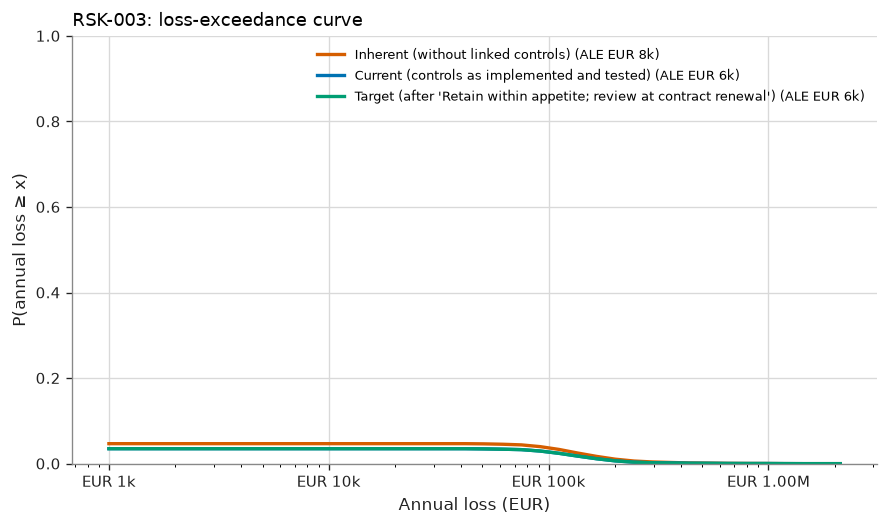
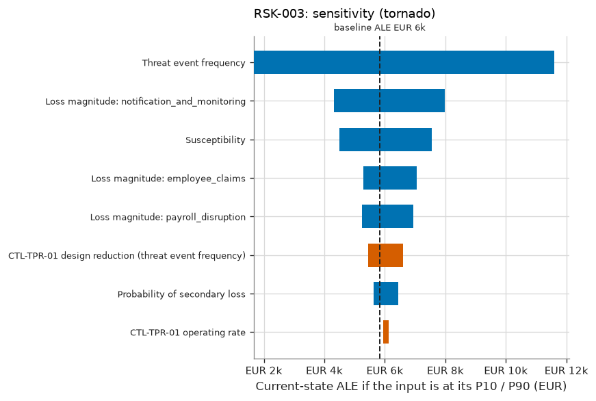

# RSK-003 — Payroll SaaS provider breach exposes employee data

RSK-003 Payroll SaaS provider breach exposes employee data: current risk 'Very Low', ALE EUR 6k (90% CI EUR 1k–EUR 15k), within appetite.

## What is the estimated risk?

The current expected annual loss (ALE) is EUR 6k, with a 90% credible interval of EUR 1k to EUR 15k. The probability of at least one loss event in a year is 4%. In a 1-in-20 bad year, losses reach EUR 0 or more (VaR 95%). The average of those worst 5% of years is EUR 117k (expected shortfall).

## Why is it at this level?

0.0373 expected loss events/yr → likelihood 'Very Low'; EUR 161,309 expected loss per event → impact 'Low'. The risk matrix gives 'Very Low'. The ALE of EUR 6k is compared with the scenario threshold of EUR 500k, and the level with the maximum acceptable level 'Moderate'. The risk is **within appetite**. Given the parameter uncertainty, the probability that the true ALE is within the threshold is 100%.

## How confident are we?

The ALE credible interval spans a factor of 13.7. 3 of 10 inputs are data-derived; the rest are expert judgement or assumptions. The largest single source of uncertainty in the ALE is Threat event frequency (rank correlation +0.96), so better measurement of this input would narrow the estimate most. 0 of the 2 controls credited today are tested effective. The Monte Carlo error on the ALE is ±EUR 292 (20,000 trials). This is simulation precision only and does not reflect input uncertainty.

## Which controls reduce it?

The linked controls, as implemented and tested, reduce the ALE from EUR 8k (inherent) to EUR 6k, a reduction of 29%. The most critical controls are CTL-TPR-01 (+EUR 2k if it failed), CTL-IR-01 (+EUR 253 if it failed).

## What if the assumptions change?

The main drivers, each moved from its P10 to its P90, are Threat event frequency (EUR 2k–EUR 12k), Loss magnitude: notification_and_monitoring (EUR 4k–EUR 8k), Susceptibility (EUR 4k–EUR 8k). Stress tests: TEF ×2: ALE EUR 11k (+93%), level 'Low'; Magnitude ×2: ALE EUR 12k (+100%), level 'Very Low'; CTL-TPR-01 fails: ALE EUR 8k (+34%), level 'Very Low'; CTL-IR-01 fails: ALE EUR 6k (+4%), level 'Very Low'.

## What mitigation has the greatest effect?

The largest risk reduction comes from option T1 'Retain within appetite; review at contract renewal': ALE −EUR 0 (±EUR 0, paired estimate), VaR95 −EUR 0. Its annualised cost is EUR 0 (no cost recorded), and the residual level would be 'Very Low'. The selected treatment gives a target ALE of EUR 6k ('Very Low').

## What assumptions were made?

- Loss events follow a Poisson process given the annual rate (events are independent in time).
- Controls acting on the same factor combine multiplicatively (independent layers of defence).
- A control's operating rate is the probability it works for a given event; failures are independent between events.
- Loss forms of the same event are positively correlated through a one-factor Gaussian copula.
- Loss-magnitude ranges describe event-to-event variability; uncertainty about severity parameters is not modelled separately (v1).
- Inherent risk is the risk without the controls linked to the scenario; the wider environment is unchanged.
- Quantitative banding: likelihood from expected loss events per year, impact from expected loss per event.

## Risk states

| State | ALE | 90% credible interval | VaR 95% | ES 95% | P(≥ 1 event) | Loss events/yr | Expected loss/event | Level (L×I) |
|---|---|---|---|---|---|---|---|---|
| Inherent (without linked controls) | EUR 8k | EUR 1k – EUR 20k | EUR 0 | EUR 164k | 5% | 0.05 | EUR 171k | Very Low (1×2) |
| Current (controls as implemented and tested) | EUR 6k | EUR 1k – EUR 15k | EUR 0 | EUR 117k | 4% | 0.04 | EUR 161k | Very Low (1×2) |
| Target (after 'Retain within appetite; review at contract renewal') | EUR 6k | EUR 1k – EUR 15k | EUR 0 | EUR 117k | 4% | 0.04 | EUR 161k | Very Low (1×2) |



## Loss breakdown by loss form (current state)

| Loss form | Mean annual amount | Share of ALE |
|---|---|---|
| Response | EUR 4k | 65.9% |
| Productivity | EUR 1k | 18.3% |
| Fines Judgments | EUR 925 | 15.9% |

## Inputs

| Input | Distribution | Provenance | Source | Rationale |
|---|---|---|---|---|
| Threat event frequency | Gamma(shape 2.09, rate 25.5), mean 0.0817, 90% CI 0.0153–0.191 [posterior from 0 events in 6 years; data credibility weight 23%] | Expert And Data | Prior: expert view of SaaS-provider breach rates. Data: 0 breaches in 6 years with this provider. | The Bayesian update moves the prior only modestly; 6 incident-free years is weak evidence for a rare event. |
| Susceptibility | PERT (min 0.3, most likely 0.6, max 0.9) | Expert Judgement | — | Probability that a provider breach includes Halcyon's tenant data. |
| Probability of secondary loss | PERT (min 0.05, most likely 0.15, max 0.4) | Expert Judgement | — | — |
| Loss magnitude: notification_and_monitoring | PERT (min 4e+04, most likely 9e+04, max 2.5e+05) | Expert Judgement | — | Notifying 1,100 employees, credit monitoring, legal review. |
| Loss magnitude: payroll_disruption | PERT (min 0, most likely 2e+04, max 1e+05) | Expert Judgement | — | — |
| Loss magnitude: employee_claims | lognormal (median 1.095e+05, 90% range 2e+04–6e+05) | Expert Judgement | — | — |
| CTL-TPR-01 design reduction (threat event frequency) | PERT (min 0.1, most likely 0.25, max 0.4) | Expert Judgement | — | Due diligence selected a provider with a clean SOC 2 Type II report and contractual security obligations. |
| CTL-TPR-01 operating rate | Beta(21, 1), mean 0.955, 90% CI 0.867–0.998 [control tests: 0 exceptions in 20 samples] | Data | control tests | coverage 100% |
| CTL-IR-01 design reduction (secondary loss probability) | PERT (min 0.2, most likely 0.4, max 0.6) | Expert Judgement | — | Prompt, well-handled notification reduces employee claims. |
| CTL-IR-01 operating rate | Beta(6, 2), mean 0.750, 90% CI 0.479–0.947 [control tests: 1 exceptions in 6 samples] | Data | control tests | coverage 100% |

## Control assessment

| Control | Conclusion | Basis | Samples | Exceptions | Posterior mean operating rate | 90% interval | Clopper-Pearson upper bound | ALE increase if it failed |
|---|---|---|---|---|---|---|---|---|
| CTL-IR-01 Incident response and regulatory notification playbook | Inconclusive | statistical | 6 | 1 | 75.0% | 47.9% – 94.7% | 51.0% | EUR 253 |
| CTL-TPR-01 Third-party security due diligence and contract clauses | Inconclusive | statistical | 20 | 0 | 95.5% | 86.7% – 99.8% | 10.9% | EUR 2k |

<details>
<summary>Control assessment detail</summary>

- **CTL-IR-01**: 1 exception(s) in 6 samples. The posterior mean operating rate is 75.0%. P(deviation rate ≤ 10%) = 15.0% against a required 90%. Conclusion: inconclusive. Classical 90% upper bound on the deviation rate: 51.0%. About 31 further exception-free samples are needed to conclude.
- **CTL-TPR-01**: 0 exception(s) in 20 samples. The posterior mean operating rate is 95.5%. P(deviation rate ≤ 10%) = 89.1% against a required 90%. Conclusion: inconclusive. Classical 90% upper bound on the deviation rate: 10.9%. About 1 further exception-free samples are needed to conclude.

</details>

## Treatment options

Effects are compared against the current state **on the same simulated years** (common random numbers), so
the paired standard error is smaller than the independent one; both are shown to make that precision gain
visible.

| Option | Type | ALE | ΔALE (paired SE) | ΔALE independent SE | ΔVaR 95% | Annualised cost | ROSI | Residual level | Within appetite |
|---|---|---|---|---|---|---|---|---|---|
| T1 Retain within appetite; review at contract renewal | Retain | EUR 6k | +EUR 0 (±EUR 0) | ±EUR 413 | +EUR 0 | EUR 0 | — (no cost recorded) | Very Low | ✅ |

## Sensitivity



Rank sensitivity: the Spearman correlation between each epistemic input's draw and the trial's conditional
expected loss, which ranks where better measurement would narrow the ALE estimate the most (top
7 shown).

| Input | Spearman ρ | Share of explained variance |
|---|---|---|
| Threat event frequency | +0.96 | 92.6% |
| Susceptibility | +0.24 | 5.9% |
| CTL-TPR-01 design reduction (threat event frequency) | -0.09 | 0.9% |
| Probability of secondary loss | +0.07 | 0.5% |
| CTL-IR-01 design reduction (secondary loss probability) | -0.02 | 0.0% |
| CTL-TPR-01 operating rate | -0.02 | 0.0% |
| CTL-IR-01 operating rate | -0.01 | 0.0% |

## Stress tests

Named what-if scenarios, re-simulated on the same random numbers as the current state.

| Stress | Description | ALE | Change vs. current ALE | VaR 95% | Resulting level |
|---|---|---|---|---|---|
| TEF ×2 | Threat event frequency doubles. | EUR 11k | +93% | EUR 110k | Low |
| Magnitude ×2 | Every loss form costs twice as much. | EUR 12k | +100% | EUR 0 | Very Low |
| CTL-TPR-01 fails | CTL-TPR-01 stops operating (operating rate = 0). | EUR 8k | +34% | EUR 0 | Very Low |
| CTL-IR-01 fails | CTL-IR-01 stops operating (operating rate = 0). | EUR 6k | +4% | EUR 0 | Very Low |

## Evaluation

| | |
|---|---|
| Decision level | Very Low |
| Scenario ALE appetite threshold | EUR 500k |
| ALE within threshold | ✅ |
| P(true ALE within threshold) | 100% |
| Maximum acceptable level | Moderate |
| Within appetite | ✅ |
| Treatment required | no |
| Acceptance authority | Risk Owner |
| Max acceptance period | 730 days |
| Review cycle | every 365 days |

The quantitative result is the decision basis (see methodology notes); the qualitative rating is retained for communication and consistency checking. Retaining a risk outside appetite requires the 'executive' authority.

## Findings

No findings.

## Model notes

None.

## Reproducibility

| | |
|---|---|
| Inputs fingerprint | `90dff8539eda874eaace2ff1b6c2eb275d1c7dc2820df5bd77afbe59e9c7985c` |
| Result fingerprint | `11c18b78a52aab0d5c9008e689d3def9f9a847ae276134da3e009bc9f63aff2d` |
| Methodology fingerprint | `af488897ff9d125d15832b2b49e050804e644d2c2a3de6ddab4e20e89d284d5a` |
| Engine version | 1.0.0 |
| Library versions | numpy 2.5.3, scipy 1.18.1 |
| Seed | 20260101 |
| Trials | 20,000 |
| As of | 2026-09-01 |

To reproduce this assessment:

```
uv run sextant assess examples/halcyon --scenario RSK-003 --trials 20000 --seed 20260101 --as-of 2026-09-01
```