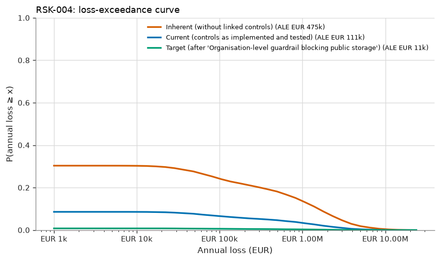
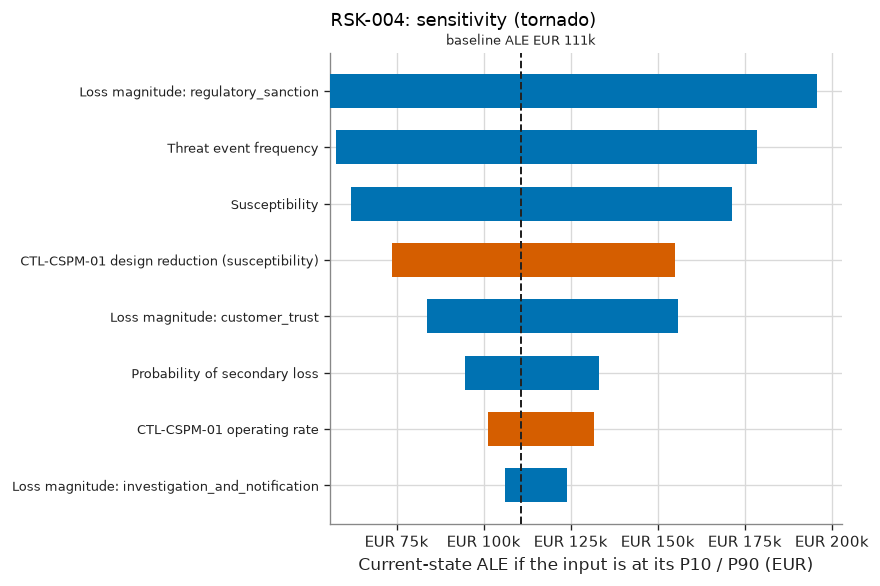

# RSK-004 — Misconfigured cloud storage exposes customs documents

RSK-004 Misconfigured cloud storage exposes customs documents: current risk 'Low', ALE EUR 111k (90% CI EUR 28k–EUR 271k), within appetite.

## What is the estimated risk?

The current expected annual loss (ALE) is EUR 111k, with a 90% credible interval of EUR 28k to EUR 271k. The probability of at least one loss event in a year is 9%. In a 1-in-20 bad year, losses reach EUR 372k or more (VaR 95%). The average of those worst 5% of years is EUR 2.13M (expected shortfall).

## Why is it at this level?

0.0923 expected loss events/yr → likelihood 'Low'; EUR 1,242,074 expected loss per event → impact 'High'. The risk matrix gives 'Low'. The ALE of EUR 111k is compared with the scenario threshold of EUR 500k, and the level with the maximum acceptable level 'Moderate'. The risk is **within appetite**. Given the parameter uncertainty, the probability that the true ALE is within the threshold is 100%.

## How confident are we?

The ALE credible interval spans a factor of 9.5. 2 of 8 inputs are data-derived; the rest are expert judgement or assumptions. The largest single source of uncertainty in the ALE is Threat event frequency (rank correlation +0.63), so better measurement of this input would narrow the estimate most. 1 of the 1 controls credited today are tested effective. The Monte Carlo error on the ALE is ±EUR 5k (20,000 trials). This is simulation precision only and does not reflect input uncertainty.

## Which controls reduce it?

The linked controls, as implemented and tested, reduce the ALE from EUR 475k (inherent) to EUR 111k, a reduction of 77%. The most critical controls are CTL-CSPM-01 (+EUR 364k if it failed).

## What if the assumptions change?

The main drivers, each moved from its P10 to its P90, are Loss magnitude: regulatory_sanction (EUR 56k–EUR 196k), Threat event frequency (EUR 58k–EUR 178k), Susceptibility (EUR 62k–EUR 171k). Stress tests: TEF ×2: ALE EUR 225k (+103%), level 'Low'; Magnitude ×2: ALE EUR 221k (+100%), level 'Low'; CTL-CSPM-01 fails: ALE EUR 475k (+329%), level 'Moderate'.

## What mitigation has the greatest effect?

The largest risk reduction comes from option T1 'Organisation-level guardrail blocking public storage': ALE −EUR 100k (±EUR 5k, paired estimate), VaR95 −EUR 372k. Its annualised cost is EUR 10k (ROSI +901%), and the residual level would be 'Low'. The selected treatment gives a target ALE of EUR 11k ('Low').

## What assumptions were made?

- Loss events follow a Poisson process given the annual rate (events are independent in time).
- Controls acting on the same factor combine multiplicatively (independent layers of defence).
- A control's operating rate is the probability it works for a given event; failures are independent between events.
- Loss forms of the same event are positively correlated through a one-factor Gaussian copula.
- Loss-magnitude ranges describe event-to-event variability; uncertainty about severity parameters is not modelled separately (v1).
- Inherent risk is the risk without the controls linked to the scenario; the wider environment is unchanged.
- Quantitative banding: likelihood from expected loss events per year, impact from expected loss per event.

## Risk states

| State | ALE | 90% credible interval | VaR 95% | ES 95% | P(≥ 1 event) | Loss events/yr | Expected loss/event | Level (L×I) |
|---|---|---|---|---|---|---|---|---|
| Inherent (without linked controls) | EUR 475k | EUR 142k – EUR 1.03M | EUR 2.83M | EUR 5.42M | 30% | 0.39 | EUR 1.24M | Moderate (3×4) |
| Current (controls as implemented and tested) | EUR 111k | EUR 28k – EUR 271k | EUR 372k | EUR 2.13M | 9% | 0.09 | EUR 1.24M | Low (2×4) |
| Target (after 'Organisation-level guardrail blocking public storage') | EUR 11k | EUR 2k – EUR 25k | EUR 0 | EUR 212k | 1% | 0.01 | EUR 1.24M | Low (1×4) |



## Loss breakdown by loss form (current state)

| Loss form | Mean annual amount | Share of ALE |
|---|---|---|
| Fines Judgments | EUR 62k | 56.2% |
| Reputation | EUR 39k | 34.9% |
| Response | EUR 10k | 8.8% |

## Inputs

| Input | Distribution | Provenance | Source | Rationale |
|---|---|---|---|---|
| Threat event frequency | Gamma(shape 5.5, rate 2.5), mean 2.2, 90% CI 0.915–3.94 [posterior from 5 events in 2.5 years; data credibility weight 100%] | Data | CSPM finding history 2024-2026 (EV-006) | Buckets made public by mistake, whether or not they were detected. The Jeffreys prior lets the data dominate. |
| Susceptibility | PERT (min 0.05, most likely 0.15, max 0.4) | Expert Judgement | — | Probability that a public bucket is found and downloaded before it is closed, if there were no detection. |
| Probability of secondary loss | PERT (min 0.4, most likely 0.6, max 0.85) | Expert Judgement | — | Personal data exposure is notifiable; regulators and customers react. |
| Loss magnitude: investigation_and_notification | lognormal (median 7.746e+04, 90% range 2e+04–3e+05) | Expert Judgement | — | — |
| Loss magnitude: regulatory_sanction | lognormal (median 6.325e+05, 90% range 1e+05–4e+06) | Expert Judgement | — | — |
| Loss magnitude: customer_trust | lognormal (median 4.472e+05, 90% range 1e+05–2e+06) | Expert Judgement | — | — |
| CTL-CSPM-01 design reduction (susceptibility) | PERT (min 0.6, most likely 0.8, max 0.95) | Expert Judgement | — | Auto-remediation closes exposure within minutes to hours, shrinking the discovery window. |
| CTL-CSPM-01 operating rate | Beta(26, 1), mean 0.963, 90% CI 0.891–0.998 [control tests: 0 exceptions in 25 samples] | Data | control tests | coverage 100% |

## Control assessment

| Control | Conclusion | Basis | Samples | Exceptions | Posterior mean operating rate | 90% interval | Clopper-Pearson upper bound | ALE increase if it failed |
|---|---|---|---|---|---|---|---|---|
| CTL-CSPM-01 Cloud security posture management with auto-remediation | Effective | statistical | 25 | 0 | 96.3% | 89.1% – 99.8% | 8.8% | EUR 364k |
| CTL-CSPM-02 Organisation-level guardrail blocking public storage | Not Tested | statistical | 0 | 0 | 50.0% | 5.0% – 95.0% | — | not credited |

<details>
<summary>Control assessment detail</summary>

- **CTL-CSPM-01**: 0 exception(s) in 25 samples. The posterior mean operating rate is 96.3%. P(deviation rate ≤ 10%) = 93.5% against a required 90%. Conclusion: effective. Classical 90% upper bound on the deviation rate: 8.8%.
- **CTL-CSPM-02**: No operating-effectiveness tests in the last 365 days. The model uses the uninformative prior (mean operating rate 50%). 21 exception-free samples would support an 'effective' conclusion.

</details>

## Treatment options

Effects are compared against the current state **on the same simulated years** (common random numbers), so
the paired standard error is smaller than the independent one; both are shown to make that precision gain
visible.

| Option | Type | ALE | ΔALE (paired SE) | ΔALE independent SE | ΔVaR 95% | Annualised cost | ROSI | Residual level | Within appetite |
|---|---|---|---|---|---|---|---|---|---|
| T1 Organisation-level guardrail blocking public storage | Modify | EUR 11k | +EUR 100k (±EUR 5k) | ±EUR 5k | +EUR 372k | EUR 10k | +901% | Low | ✅ |

## Sensitivity



Rank sensitivity: the Spearman correlation between each epistemic input's draw and the trial's conditional
expected loss, which ranks where better measurement would narrow the ALE estimate the most (top
5 shown).

| Input | Spearman ρ | Share of explained variance |
|---|---|---|
| Threat event frequency | +0.63 | 42.9% |
| Susceptibility | +0.56 | 32.9% |
| CTL-CSPM-01 design reduction (susceptibility) | -0.41 | 17.9% |
| Probability of secondary loss | +0.18 | 3.6% |
| CTL-CSPM-01 operating rate | -0.16 | 2.7% |

## Stress tests

Named what-if scenarios, re-simulated on the same random numbers as the current state.

| Stress | Description | ALE | Change vs. current ALE | VaR 95% | Resulting level |
|---|---|---|---|---|---|
| TEF ×2 | Threat event frequency doubles. | EUR 225k | +103% | EUR 1.46M | Low |
| Magnitude ×2 | Every loss form costs twice as much. | EUR 221k | +100% | EUR 744k | Low |
| CTL-CSPM-01 fails | CTL-CSPM-01 stops operating (operating rate = 0). | EUR 475k | +329% | EUR 2.83M | Moderate |

## Evaluation

| | |
|---|---|
| Decision level | Low |
| Scenario ALE appetite threshold | EUR 500k |
| ALE within threshold | ✅ |
| P(true ALE within threshold) | 100% |
| Maximum acceptable level | Moderate |
| Within appetite | ✅ |
| Treatment required | no |
| Acceptance authority | Risk Owner |
| Max acceptance period | 365 days |
| Review cycle | every 365 days |

The quantitative result is the decision basis (see methodology notes); the qualitative rating is retained for communication and consistency checking. Retaining a risk outside appetite requires the 'executive' authority.

## Findings

No findings.

## Model notes

None.

## Reproducibility

| | |
|---|---|
| Inputs fingerprint | `b0d8090d349a5981c4759f43eff08533067074a5fc91f76940451a9c70bce4bc` |
| Result fingerprint | `a21204bb9b3cdc7a872b0e695025c77ed9cb4139f23396d4606462460c642cb8` |
| Methodology fingerprint | `af488897ff9d125d15832b2b49e050804e644d2c2a3de6ddab4e20e89d284d5a` |
| Engine version | 1.0.0 |
| Library versions | numpy 2.5.3, scipy 1.18.1 |
| Seed | 20260101 |
| Trials | 20,000 |
| As of | 2026-09-01 |

To reproduce this assessment:

```
uv run sextant assess examples/halcyon --scenario RSK-004 --trials 20000 --seed 20260101 --as-of 2026-09-01
```