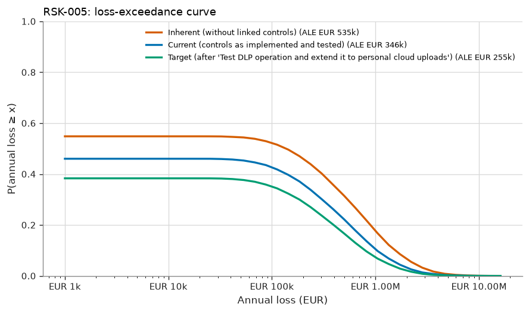
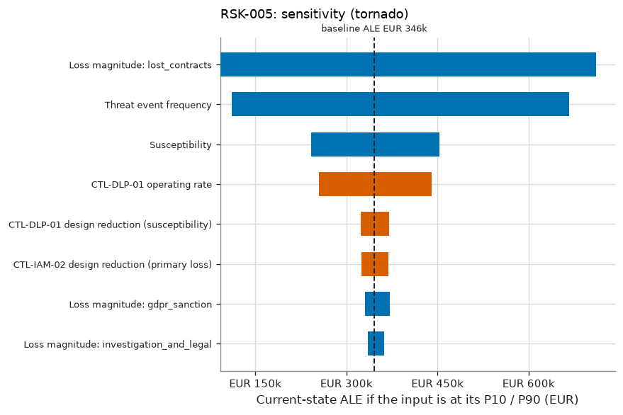

# RSK-005 — Departing employee exfiltrates customer and pricing data

RSK-005 Departing employee exfiltrates customer and pricing data: current risk 'Moderate', ALE EUR 346k (90% CI EUR 73k–EUR 915k), within appetite.

## What is the estimated risk?

The current expected annual loss (ALE) is EUR 346k, with a 90% credible interval of EUR 73k to EUR 915k. The probability of at least one loss event in a year is 46%. In a 1-in-20 bad year, losses reach EUR 1.60M or more (VaR 95%). The average of those worst 5% of years is EUR 2.69M (expected shortfall).

## Why is it at this level?

0.757 expected loss events/yr → likelihood 'Moderate'; EUR 458,680 expected loss per event → impact 'Moderate'. The risk matrix gives 'Moderate'. The ALE of EUR 346k is compared with the scenario threshold of EUR 500k, and the level with the maximum acceptable level 'Moderate'. The risk is **within appetite**. Given the parameter uncertainty, the probability that the true ALE is within the threshold is 80%. The analyst's qualitative rating (likelihood 2 × impact 3 → 'Low') is DIFFERENT from the quantitative result.

## How confident are we?

The ALE credible interval spans a factor of 12.5. 1 of 10 inputs are data-derived; the rest are expert judgement or assumptions. The largest single source of uncertainty in the ALE is Threat event frequency (rank correlation +0.90), so better measurement of this input would narrow the estimate most. 0 of the 2 controls credited today are tested effective. The Monte Carlo error on the ALE is ±EUR 5k (20,000 trials). This is simulation precision only and does not reflect input uncertainty.

## Which controls reduce it?

The linked controls, as implemented and tested, reduce the ALE from EUR 535k (inherent) to EUR 346k, a reduction of 35%. The most critical controls are CTL-DLP-01 (+EUR 115k if it failed), CTL-IAM-02 (+EUR 55k if it failed).

## What if the assumptions change?

The main drivers, each moved from its P10 to its P90, are Loss magnitude: lost_contracts (EUR 92k–EUR 711k), Threat event frequency (EUR 111k–EUR 667k), Susceptibility (EUR 242k–EUR 453k). Stress tests: TEF ×2: ALE EUR 698k (+102%), level 'Moderate'; Magnitude ×2: ALE EUR 692k (+100%), level 'Moderate'; CTL-DLP-01 fails: ALE EUR 461k (+33%), level 'Moderate'; CTL-IAM-02 fails: ALE EUR 401k (+16%), level 'Moderate'.

## What mitigation has the greatest effect?

The largest risk reduction comes from option T1 'Test DLP operation and extend it to personal cloud uploads': ALE −EUR 91k (±EUR 2k, paired estimate), VaR95 −EUR 310k. Its annualised cost is EUR 25k (ROSI +262%), and the residual level would be 'Moderate'. The selected treatment gives a target ALE of EUR 255k ('Moderate').

## What assumptions were made?

- Loss events follow a Poisson process given the annual rate (events are independent in time).
- Controls acting on the same factor combine multiplicatively (independent layers of defence).
- A control's operating rate is the probability it works for a given event; failures are independent between events.
- Loss forms of the same event are positively correlated through a one-factor Gaussian copula.
- Loss-magnitude ranges describe event-to-event variability; uncertainty about severity parameters is not modelled separately (v1).
- Inherent risk is the risk without the controls linked to the scenario; the wider environment is unchanged.
- Quantitative banding: likelihood from expected loss events per year, impact from expected loss per event.

## Risk states

| State | ALE | 90% credible interval | VaR 95% | ES 95% | P(≥ 1 event) | Loss events/yr | Expected loss/event | Level (L×I) |
|---|---|---|---|---|---|---|---|---|
| Inherent (without linked controls) | EUR 535k | EUR 123k – EUR 1.37M | EUR 2.32M | EUR 3.70M | 55% | 1.01 | EUR 533k | Moderate (4×3) |
| Current (controls as implemented and tested) | EUR 346k | EUR 73k – EUR 915k | EUR 1.60M | EUR 2.69M | 46% | 0.76 | EUR 459k | Moderate (3×3) |
| Target (after 'Test DLP operation and extend it to personal cloud uploads') | EUR 255k | EUR 57k – EUR 665k | EUR 1.29M | EUR 2.22M | 38% | 0.56 | EUR 459k | Moderate (3×3) |



## Loss breakdown by loss form (current state)

| Loss form | Mean annual amount | Share of ALE |
|---|---|---|
| Competitive Advantage | EUR 301k | 87.0% |
| Response | EUR 25k | 7.2% |
| Fines Judgments | EUR 20k | 5.8% |

## Inputs

| Input | Distribution | Provenance | Source | Rationale |
|---|---|---|---|---|
| Threat event frequency | lognormal (median 1.581, 90% range 0.5–5) | Expert Judgement | HR leaver analysis and two legal cases (2022, 2025) | Attempts per year by leavers to take commercially sensitive data. |
| Susceptibility | PERT (min 0.2, most likely 0.5, max 0.8) | Expert Judgement | — | Probability an attempt succeeds without the linked controls. |
| Probability of secondary loss | PERT (min 0.05, most likely 0.15, max 0.35) | Expert Judgement | — | — |
| Loss magnitude: lost_contracts | lognormal (median 2.739e+05, 90% range 5e+04–1.5e+06) | Expert Judgement | — | — |
| Loss magnitude: investigation_and_legal | PERT (min 1e+04, most likely 3e+04, max 1e+05) | Expert Judgement | — | — |
| Loss magnitude: gdpr_sanction | lognormal (median 1e+05, 90% range 2e+04–5e+05) | Expert Judgement | — | — |
| CTL-DLP-01 design reduction (susceptibility) | PERT (min 0.3, most likely 0.5, max 0.7) | Expert Judgement | — | DLP blocks bulk transfers through email and USB; personal cloud uploads are only partly covered. |
| CTL-DLP-01 operating rate | Beta(1, 1), mean 0.500, 90% CI 0.050–0.950 [untested: uninformative prior] | Assumption | uninformative prior (untested) | coverage 100% |
| CTL-IAM-02 design reduction (primary loss) | PERT (min 0.05, most likely 0.15, max 0.3) | Expert Judgement | — | Access reviews remove excess CRM export rights and limit the volume that can be taken. |
| CTL-IAM-02 operating rate | Beta(25, 2), mean 0.926, 90% CI 0.830–0.986 [control tests: 1 exceptions in 25 samples] | Data | control tests | coverage 100% |

## Control assessment

| Control | Conclusion | Basis | Samples | Exceptions | Posterior mean operating rate | 90% interval | Clopper-Pearson upper bound | ALE increase if it failed |
|---|---|---|---|---|---|---|---|---|
| CTL-DLP-01 Data loss prevention for email and endpoints | Not Tested | statistical | 0 | 0 | 50.0% | 5.0% – 95.0% | — | EUR 115k |
| CTL-IAM-02 Quarterly privileged access review | Not Effective | judgemental (frequency-based) | 25 | 1 | 92.6% | 83.0% – 98.6% | 14.7% | EUR 55k |

<details>
<summary>Control assessment detail</summary>

- **CTL-DLP-01**: No operating-effectiveness tests in the last 365 days. The model uses the uninformative prior (mean operating rate 50%). 21 exception-free samples would support an 'effective' conclusion.
- **CTL-IAM-02**: Quarterly control: 1 exception(s) in 25 samples (audit convention: at least 2 samples and no exceptions). Conclusion: not effective. The risk model still uses the posterior operating rate (mean 93%), which reflects how little a small sample proves.

</details>

## Treatment options

Effects are compared against the current state **on the same simulated years** (common random numbers), so
the paired standard error is smaller than the independent one; both are shown to make that precision gain
visible.

| Option | Type | ALE | ΔALE (paired SE) | ΔALE independent SE | ΔVaR 95% | Annualised cost | ROSI | Residual level | Within appetite |
|---|---|---|---|---|---|---|---|---|---|
| T1 Test DLP operation and extend it to personal cloud uploads | Modify | EUR 255k | +EUR 91k (±EUR 2k) | ±EUR 7k | +EUR 310k | EUR 25k | +262% | Moderate | ✅ |

## Sensitivity



Rank sensitivity: the Spearman correlation between each epistemic input's draw and the trial's conditional
expected loss, which ranks where better measurement would narrow the ALE estimate the most (top
7 shown).

| Input | Spearman ρ | Share of explained variance |
|---|---|---|
| Threat event frequency | +0.90 | 83.7% |
| Susceptibility | +0.29 | 8.9% |
| CTL-DLP-01 operating rate | -0.25 | 6.5% |
| CTL-DLP-01 design reduction (susceptibility) | -0.07 | 0.5% |
| CTL-IAM-02 design reduction (primary loss) | -0.06 | 0.4% |
| Probability of secondary loss | +0.01 | 0.0% |
| CTL-IAM-02 operating rate | -0.01 | 0.0% |

## Stress tests

Named what-if scenarios, re-simulated on the same random numbers as the current state.

| Stress | Description | ALE | Change vs. current ALE | VaR 95% | Resulting level |
|---|---|---|---|---|---|
| TEF ×2 | Threat event frequency doubles. | EUR 698k | +102% | EUR 2.77M | Moderate |
| Magnitude ×2 | Every loss form costs twice as much. | EUR 692k | +100% | EUR 3.20M | Moderate |
| CTL-DLP-01 fails | CTL-DLP-01 stops operating (operating rate = 0). | EUR 461k | +33% | EUR 2.02M | Moderate |
| CTL-IAM-02 fails | CTL-IAM-02 stops operating (operating rate = 0). | EUR 401k | +16% | EUR 1.86M | Moderate |

## Qualitative vs quantitative comparison

| State | Quantitative level (L×I) | Qualitative level (L×I) | Agree |
|---|---|---|---|
| inherent | Moderate (4×3=12) | Moderate (3×3=9) | ✅ |
| current | Moderate (3×3=9) | Low (2×3=6) | ⚠️ differs |

## Evaluation

| | |
|---|---|
| Decision level | Moderate |
| Scenario ALE appetite threshold | EUR 500k |
| ALE within threshold | ✅ |
| P(true ALE within threshold) | 80% |
| Maximum acceptable level | Moderate |
| Within appetite | ✅ |
| Treatment required | no |
| Acceptance authority | Risk Manager |
| Max acceptance period | 365 days |
| Review cycle | every 180 days |

The quantitative result is the decision basis (see methodology notes); the qualitative rating is retained for communication and consistency checking. Retaining a risk outside appetite requires the 'executive' authority.

## Findings

| Severity | Code | Message |
|---|---|---|
| ℹ️ info | `CTL-UNTESTED` | CTL-DLP-01 is credited without operating-effectiveness evidence (prior only). |
| ⚠️ warning | `CTL-NOT-EFFECTIVE` | CTL-IAM-02 tested NOT effective (1/25 exceptions); its reduced credit is reflected, but remediation should be tracked. |
| ⚠️ warning | `QUAL-REDUCTION-UNEVIDENCED` | Risk reduction is claimed, but none of the credited controls is tested effective. |

## Model notes

None.

## Reproducibility

| | |
|---|---|
| Inputs fingerprint | `7e1030ebc441c14f783400f92a1d81c5fc8aad8927aa7bfa8fa59dd211290bca` |
| Result fingerprint | `3544de4279714ab8cf321567beb58c88f829b6a2d7a363c0a22bcabb0f8a67dd` |
| Methodology fingerprint | `af488897ff9d125d15832b2b49e050804e644d2c2a3de6ddab4e20e89d284d5a` |
| Engine version | 1.0.0 |
| Library versions | numpy 2.5.3, scipy 1.18.1 |
| Seed | 20260101 |
| Trials | 20,000 |
| As of | 2026-09-01 |

To reproduce this assessment:

```
uv run sextant assess examples/halcyon --scenario RSK-005 --trials 20000 --seed 20260101 --as-of 2026-09-01
```