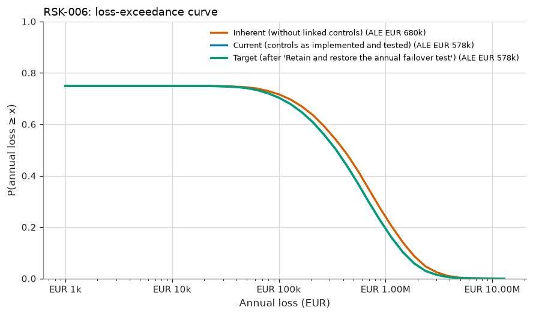
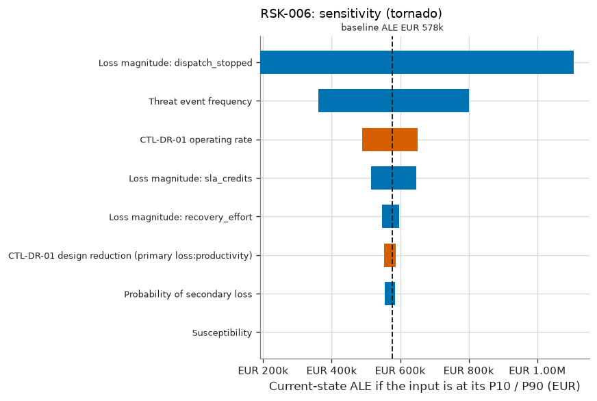

# RSK-006 — Prolonged warehouse management system outage

RSK-006 Prolonged warehouse management system outage: current risk 'Moderate', ALE EUR 578k (90% CI EUR 309k–EUR 903k), OUTSIDE appetite.

## What is the estimated risk?

The current expected annual loss (ALE) is EUR 578k, with a 90% credible interval of EUR 309k to EUR 903k. The probability of at least one loss event in a year is 74%. In a 1-in-20 bad year, losses reach EUR 1.99M or more (VaR 95%). The average of those worst 5% of years is EUR 2.84M (expected shortfall).

## Why is it at this level?

1.44 expected loss events/yr → likelihood 'High'; EUR 394,874 expected loss per event → impact 'Moderate'. The risk matrix gives 'Moderate'. The ALE of EUR 578k is compared with the scenario threshold of EUR 500k, and the level with the maximum acceptable level 'Moderate'. The risk is **OUTSIDE appetite**. Given the parameter uncertainty, the probability that the true ALE is within the threshold is 39%.

## How confident are we?

The ALE credible interval spans a factor of 2.9. 1 of 8 inputs are data-derived; the rest are expert judgement or assumptions. The largest single source of uncertainty in the ALE is Threat event frequency (rank correlation +0.93), so better measurement of this input would narrow the estimate most. 0 of the 1 controls credited today are tested effective. The Monte Carlo error on the ALE is ±EUR 5k (20,000 trials). This is simulation precision only and does not reflect input uncertainty.

## Which controls reduce it?

The linked controls, as implemented and tested, reduce the ALE from EUR 680k (inherent) to EUR 578k, a reduction of 15%. The most critical controls are CTL-DR-01 (+EUR 102k if it failed).

## What if the assumptions change?

The main drivers, each moved from its P10 to its P90, are Loss magnitude: dispatch_stopped (EUR 192k–EUR 1.11M), Threat event frequency (EUR 362k–EUR 800k), CTL-DR-01 operating rate (EUR 651k–EUR 488k). Stress tests: TEF ×2: ALE EUR 1.15M (+99%), level 'Moderate'; Magnitude ×2: ALE EUR 1.16M (+100%), level 'Moderate'; CTL-DR-01 fails: ALE EUR 680k (+18%), level 'Moderate'.

## What mitigation has the greatest effect?

The largest risk reduction comes from option T1 'Active-active multi-region WMS': ALE −EUR 226k (±EUR 2k, paired estimate), VaR95 −EUR 790k. Its annualised cost is EUR 253k (ROSI -11%), and the residual level would be 'Low'. Other options: T2 ALE −EUR 0, cost EUR 0/yr. The selected treatment gives a target ALE of EUR 578k ('Moderate').

## What assumptions were made?

- Loss events follow a Poisson process given the annual rate (events are independent in time).
- Controls acting on the same factor combine multiplicatively (independent layers of defence).
- A control's operating rate is the probability it works for a given event; failures are independent between events.
- Loss forms of the same event are positively correlated through a one-factor Gaussian copula.
- Loss-magnitude ranges describe event-to-event variability; uncertainty about severity parameters is not modelled separately (v1).
- Inherent risk is the risk without the controls linked to the scenario; the wider environment is unchanged.
- Quantitative banding: likelihood from expected loss events per year, impact from expected loss per event.
- Outages are treated as independent events; a common cause, such as a provider-wide failure, is not modelled separately.

## Risk states

| State | ALE | 90% credible interval | VaR 95% | ES 95% | P(≥ 1 event) | Loss events/yr | Expected loss/event | Level (L×I) |
|---|---|---|---|---|---|---|---|---|
| Inherent (without linked controls) | EUR 680k | EUR 375k – EUR 1.04M | EUR 2.32M | EUR 3.32M | 74% | 1.44 | EUR 465k | Moderate (4×3) |
| Current (controls as implemented and tested) | EUR 578k | EUR 309k – EUR 903k | EUR 1.99M | EUR 2.84M | 74% | 1.44 | EUR 395k | Moderate (4×3) |
| Target (after 'Retain and restore the annual failover test') | EUR 578k | EUR 309k – EUR 903k | EUR 1.99M | EUR 2.84M | 74% | 1.44 | EUR 395k | Moderate (4×3) |



## Loss breakdown by loss form (current state)

| Loss form | Mean annual amount | Share of ALE |
|---|---|---|
| Productivity | EUR 468k | 81.0% |
| Fines Judgments | EUR 69k | 12.0% |
| Response | EUR 40k | 7.0% |

## Inputs

| Input | Distribution | Provenance | Source | Rationale |
|---|---|---|---|---|
| Threat event frequency | Gamma(shape 10.8, rate 7.48), mean 1.44, 90% CI 0.803–2.23 [posterior from 7 events in 5 years; data credibility weight 67%] | Expert And Data | data/wms_outages.csv (2021-2025) blended with an IT-operations expert prior | Qualifying outages (> 4 hours) per year. |
| Susceptibility | constant 1 | Assumption | — | By definition every qualifying outage causes loss, so the frequency is estimated at loss-event level. |
| Probability of secondary loss | PERT (min 0.2, most likely 0.35, max 0.5) | Expert Judgement | — | Share of outages that trigger contractual SLA credits. |
| Loss magnitude: dispatch_stopped | lognormal (median 2.449e+05, 90% range 5e+04–1.2e+06) | Expert Judgement | Finance BIA 2026 | — |
| Loss magnitude: recovery_effort | PERT (min 5,000, most likely 2e+04, max 8e+04) | Expert Judgement | — | — |
| Loss magnitude: sla_credits | lognormal (median 8.944e+04, 90% range 2e+04–4e+05) | Expert Judgement | — | — |
| CTL-DR-01 design reduction (primary loss:productivity) | PERT (min 0.4, most likely 0.6, max 0.8) | Expert Judgement | — | Failover to the warm standby cuts outage duration for the covered sites. |
| CTL-DR-01 operating rate | Beta(1, 1), mean 0.500, 90% CI 0.050–0.950 [untested: uninformative prior] | Assumption | uninformative prior (untested) | coverage 60% |

## Control assessment

| Control | Conclusion | Basis | Samples | Exceptions | Posterior mean operating rate | 90% interval | Clopper-Pearson upper bound | ALE increase if it failed |
|---|---|---|---|---|---|---|---|---|
| CTL-DR-01 WMS disaster recovery (warm standby) | Not Tested | statistical | 0 | 0 | 50.0% | 5.0% – 95.0% | — | EUR 102k |

<details>
<summary>Control assessment detail</summary>

- **CTL-DR-01**: No operating-effectiveness tests in the last 365 days. The model uses the uninformative prior (mean operating rate 50%). 21 exception-free samples would support an 'effective' conclusion.

</details>

## Treatment options

Effects are compared against the current state **on the same simulated years** (common random numbers), so
the paired standard error is smaller than the independent one; both are shown to make that precision gain
visible.

| Option | Type | ALE | ΔALE (paired SE) | ΔALE independent SE | ΔVaR 95% | Annualised cost | ROSI | Residual level | Within appetite |
|---|---|---|---|---|---|---|---|---|---|
| T1 Active-active multi-region WMS | Modify | EUR 351k | +EUR 226k (±EUR 2k) | ±EUR 6k | +EUR 790k | EUR 253k | -11% | Low | ✅ |
| T2 Retain and restore the annual failover test | Retain | EUR 578k | +EUR 0 (±EUR 0) | ±EUR 7k | +EUR 0 | EUR 0 | — (no cost recorded) | Moderate | ❌ |

## Sensitivity



Rank sensitivity: the Spearman correlation between each epistemic input's draw and the trial's conditional
expected loss, which ranks where better measurement would narrow the ALE estimate the most (top
4 shown).

| Input | Spearman ρ | Share of explained variance |
|---|---|---|
| Threat event frequency | +0.93 | 89.1% |
| CTL-DR-01 operating rate | -0.31 | 10.1% |
| CTL-DR-01 design reduction (primary loss:productivity) | -0.07 | 0.5% |
| Probability of secondary loss | +0.06 | 0.4% |

## Stress tests

Named what-if scenarios, re-simulated on the same random numbers as the current state.

| Stress | Description | ALE | Change vs. current ALE | VaR 95% | Resulting level |
|---|---|---|---|---|---|
| TEF ×2 | Threat event frequency doubles. | EUR 1.15M | +99% | EUR 3.20M | Moderate |
| Magnitude ×2 | Every loss form costs twice as much. | EUR 1.16M | +100% | EUR 3.98M | Moderate |
| CTL-DR-01 fails | CTL-DR-01 stops operating (operating rate = 0). | EUR 680k | +18% | EUR 2.32M | Moderate |

## Evaluation

| | |
|---|---|
| Decision level | Moderate |
| Scenario ALE appetite threshold | EUR 500k |
| ALE within threshold | ❌ |
| P(true ALE within threshold) | 39% |
| Maximum acceptable level | Moderate |
| Within appetite | ❌ |
| Treatment required | yes |
| Acceptance authority | Executive |
| Max acceptance period | 365 days |
| Review cycle | every 180 days |

The quantitative result is the decision basis (see methodology notes); the qualitative rating is retained for communication and consistency checking. Retaining a risk outside appetite requires the 'executive' authority.

## Findings

| Severity | Code | Message |
|---|---|---|
| ℹ️ info | `CTL-UNTESTED` | CTL-DR-01 is credited without operating-effectiveness evidence (prior only). |

## Model notes

None.

## Reproducibility

| | |
|---|---|
| Inputs fingerprint | `a907bdd95798103b0b5fd3889bad1c7caf480ba9f5e154746f8439ae46866aef` |
| Result fingerprint | `fbd998a6faa4c5e4d155493e31cc29bac61a47e691e9c157283add3456ab5818` |
| Methodology fingerprint | `af488897ff9d125d15832b2b49e050804e644d2c2a3de6ddab4e20e89d284d5a` |
| Engine version | 1.0.0 |
| Library versions | numpy 2.5.3, scipy 1.18.1 |
| Seed | 20260101 |
| Trials | 20,000 |
| As of | 2026-09-01 |

To reproduce this assessment:

```
uv run sextant assess examples/halcyon --scenario RSK-006 --trials 20000 --seed 20260101 --as-of 2026-09-01
```