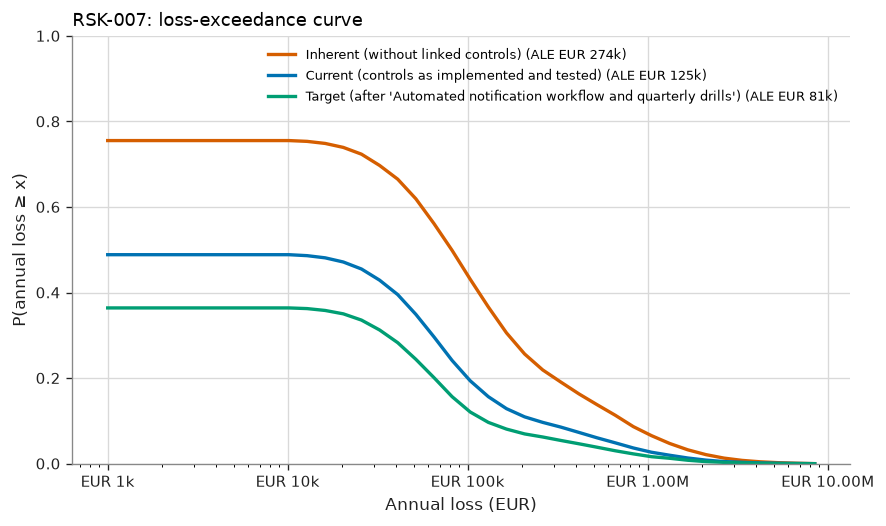
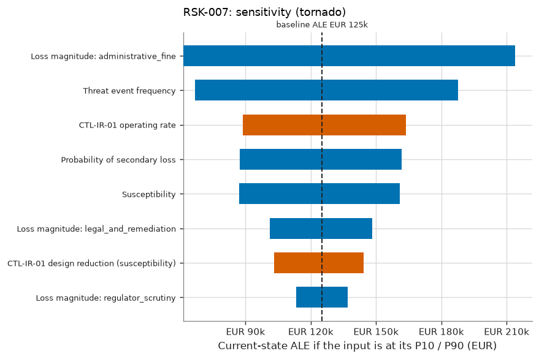

# RSK-007 — Late or deficient regulatory incident notification

RSK-007 Late or deficient regulatory incident notification: current risk 'Low', ALE EUR 125k (90% CI EUR 39k–EUR 268k), within appetite.

## What is the estimated risk?

The current expected annual loss (ALE) is EUR 125k, with a 90% credible interval of EUR 39k to EUR 268k. The probability of at least one loss event in a year is 49%. In a 1-in-20 bad year, losses reach EUR 642k or more (VaR 95%). The average of those worst 5% of years is EUR 1.49M (expected shortfall).

## Why is it at this level?

0.736 expected loss events/yr → likelihood 'Moderate'; EUR 168,264 expected loss per event → impact 'Low'. The risk matrix gives 'Low'. The ALE of EUR 125k is compared with the scenario threshold of EUR 500k, and the level with the maximum acceptable level 'Moderate'. The risk is **within appetite**. Given the parameter uncertainty, the probability that the true ALE is within the threshold is 100%.

## How confident are we?

The ALE credible interval spans a factor of 7.0. 2 of 8 inputs are data-derived; the rest are expert judgement or assumptions. The largest single source of uncertainty in the ALE is Threat event frequency (rank correlation +0.67), so better measurement of this input would narrow the estimate most. 0 of the 1 controls credited today are tested effective. The Monte Carlo error on the ALE is ±EUR 3k (20,000 trials). This is simulation precision only and does not reflect input uncertainty.

## Which controls reduce it?

The linked controls, as implemented and tested, reduce the ALE from EUR 274k (inherent) to EUR 125k, a reduction of 54%. The most critical controls are CTL-IR-01 (+EUR 149k if it failed).

## What if the assumptions change?

The main drivers, each moved from its P10 to its P90, are Loss magnitude: administrative_fine (EUR 61k–EUR 214k), Threat event frequency (EUR 67k–EUR 188k), CTL-IR-01 operating rate (EUR 164k–EUR 89k). Stress tests: TEF ×2: ALE EUR 249k (+99%), level 'Low'; Magnitude ×2: ALE EUR 250k (+100%), level 'Moderate'; CTL-IR-01 fails: ALE EUR 274k (+119%), level 'Low'.

## What mitigation has the greatest effect?

The largest risk reduction comes from option T1 'Automated notification workflow and quarterly drills': ALE −EUR 44k (±EUR 2k, paired estimate), VaR95 −EUR 271k. Its annualised cost is EUR 30k (ROSI +47%), and the residual level would be 'Low'. The selected treatment gives a target ALE of EUR 81k ('Low').

## What assumptions were made?

- Loss events follow a Poisson process given the annual rate (events are independent in time).
- Controls acting on the same factor combine multiplicatively (independent layers of defence).
- A control's operating rate is the probability it works for a given event; failures are independent between events.
- Loss forms of the same event are positively correlated through a one-factor Gaussian copula.
- Loss-magnitude ranges describe event-to-event variability; uncertainty about severity parameters is not modelled separately (v1).
- Inherent risk is the risk without the controls linked to the scenario; the wider environment is unchanged.
- Quantitative banding: likelihood from expected loss events per year, impact from expected loss per event.
- Only six notifications are available to test the control, so its operating rate stays uncertain; this is reported as an inconclusive test.

## Risk states

| State | ALE | 90% credible interval | VaR 95% | ES 95% | P(≥ 1 event) | Loss events/yr | Expected loss/event | Level (L×I) |
|---|---|---|---|---|---|---|---|---|
| Inherent (without linked controls) | EUR 274k | EUR 99k – EUR 549k | EUR 1.27M | EUR 2.38M | 75% | 1.63 | EUR 168k | Low (4×2) |
| Current (controls as implemented and tested) | EUR 125k | EUR 39k – EUR 268k | EUR 642k | EUR 1.49M | 49% | 0.74 | EUR 168k | Low (3×2) |
| Target (after 'Automated notification workflow and quarterly drills') | EUR 81k | EUR 26k – EUR 174k | EUR 372k | EUR 1.10M | 36% | 0.48 | EUR 168k | Low (3×2) |



## Loss breakdown by loss form (current state)

| Loss form | Mean annual amount | Share of ALE |
|---|---|---|
| Fines Judgments | EUR 72k | 57.8% |
| Response | EUR 39k | 31.4% |
| Reputation | EUR 13k | 10.8% |

## Inputs

| Input | Distribution | Provenance | Source | Rationale |
|---|---|---|---|---|
| Threat event frequency | Gamma(shape 6.5, rate 1.67), mean 3.89, 90% CI 1.76–6.7 [posterior from 6 events in 1.67 years; data credibility weight 100%] | Data | Incident notification log 2025-2026 (EV-015) | Notifiable incidents per year (each one is an opportunity to notify late). |
| Susceptibility | PERT (min 0.2, most likely 0.4, max 0.7) | Expert Judgement | — | Probability of a late or deficient notification without a playbook. |
| Probability of secondary loss | PERT (min 0.05, most likely 0.15, max 0.35) | Expert Judgement | — | Probability that the authority imposes a sanction for a late notification. |
| Loss magnitude: legal_and_remediation | PERT (min 1e+04, most likely 4e+04, max 1.5e+05) | Expert Judgement | — | — |
| Loss magnitude: administrative_fine | lognormal (median 3.162e+05, 90% range 5e+04–2e+06, capped at 7,000,000) | Expert Judgement | — | Capped at the NIS2 maximum for important entities (EUR 7M or 1.4% of turnover, whichever is higher). |
| Loss magnitude: regulator_scrutiny | lognormal (median 7.746e+04, 90% range 2e+04–3e+05) | Expert Judgement | — | — |
| CTL-IR-01 design reduction (susceptibility) | PERT (min 0.5, most likely 0.75, max 0.9) | Expert Judgement | — | The playbook defines roles, templates and clocks for the 24h / 72h / 1-month notifications. |
| CTL-IR-01 operating rate | Beta(6, 2), mean 0.750, 90% CI 0.479–0.947 [control tests: 1 exceptions in 6 samples] | Data | control tests | coverage 100% |

## Control assessment

| Control | Conclusion | Basis | Samples | Exceptions | Posterior mean operating rate | 90% interval | Clopper-Pearson upper bound | ALE increase if it failed |
|---|---|---|---|---|---|---|---|---|
| CTL-IR-01 Incident response and regulatory notification playbook | Inconclusive | statistical | 6 | 1 | 75.0% | 47.9% – 94.7% | 51.0% | EUR 149k |

<details>
<summary>Control assessment detail</summary>

- **CTL-IR-01**: 1 exception(s) in 6 samples. The posterior mean operating rate is 75.0%. P(deviation rate ≤ 10%) = 15.0% against a required 90%. Conclusion: inconclusive. Classical 90% upper bound on the deviation rate: 51.0%. About 31 further exception-free samples are needed to conclude.

</details>

## Treatment options

Effects are compared against the current state **on the same simulated years** (common random numbers), so
the paired standard error is smaller than the independent one; both are shown to make that precision gain
visible.

| Option | Type | ALE | ΔALE (paired SE) | ΔALE independent SE | ΔVaR 95% | Annualised cost | ROSI | Residual level | Within appetite |
|---|---|---|---|---|---|---|---|---|---|
| T1 Automated notification workflow and quarterly drills | Modify | EUR 81k | +EUR 44k (±EUR 2k) | ±EUR 4k | +EUR 271k | EUR 30k | +47% | Low | ✅ |

## Sensitivity



Rank sensitivity: the Spearman correlation between each epistemic input's draw and the trial's conditional
expected loss, which ranks where better measurement would narrow the ALE estimate the most (top
5 shown).

| Input | Spearman ρ | Share of explained variance |
|---|---|---|
| Threat event frequency | +0.67 | 47.8% |
| CTL-IR-01 operating rate | -0.39 | 16.4% |
| Susceptibility | +0.38 | 15.5% |
| Probability of secondary loss | +0.37 | 14.6% |
| CTL-IR-01 design reduction (susceptibility) | -0.23 | 5.6% |

## Stress tests

Named what-if scenarios, re-simulated on the same random numbers as the current state.

| Stress | Description | ALE | Change vs. current ALE | VaR 95% | Resulting level |
|---|---|---|---|---|---|
| TEF ×2 | Threat event frequency doubles. | EUR 249k | +99% | EUR 1.18M | Low |
| Magnitude ×2 | Every loss form costs twice as much. | EUR 250k | +100% | EUR 1.28M | Moderate |
| CTL-IR-01 fails | CTL-IR-01 stops operating (operating rate = 0). | EUR 274k | +119% | EUR 1.27M | Low |

## Evaluation

| | |
|---|---|
| Decision level | Low |
| Scenario ALE appetite threshold | EUR 500k |
| ALE within threshold | ✅ |
| P(true ALE within threshold) | 100% |
| Maximum acceptable level | Moderate |
| Within appetite | ✅ |
| Treatment required | no |
| Acceptance authority | Risk Owner |
| Max acceptance period | 365 days |
| Review cycle | every 365 days |

The quantitative result is the decision basis (see methodology notes); the qualitative rating is retained for communication and consistency checking. Retaining a risk outside appetite requires the 'executive' authority.

## Findings

No findings.

## Model notes

None.

## Reproducibility

| | |
|---|---|
| Inputs fingerprint | `18dbc439491ddaa81d25257f1cdfd2686acac05287a119eda925e552a7a5b2c8` |
| Result fingerprint | `7d2d950a545ee0ce4d889bb1d3545a7d5ccd4d47fbfba0cdde0c85e303ed79fb` |
| Methodology fingerprint | `af488897ff9d125d15832b2b49e050804e644d2c2a3de6ddab4e20e89d284d5a` |
| Engine version | 1.0.0 |
| Library versions | numpy 2.5.3, scipy 1.18.1 |
| Seed | 20260101 |
| Trials | 20,000 |
| As of | 2026-09-01 |

To reproduce this assessment:

```
uv run sextant assess examples/halcyon --scenario RSK-007 --trials 20000 --seed 20260101 --as-of 2026-09-01
```