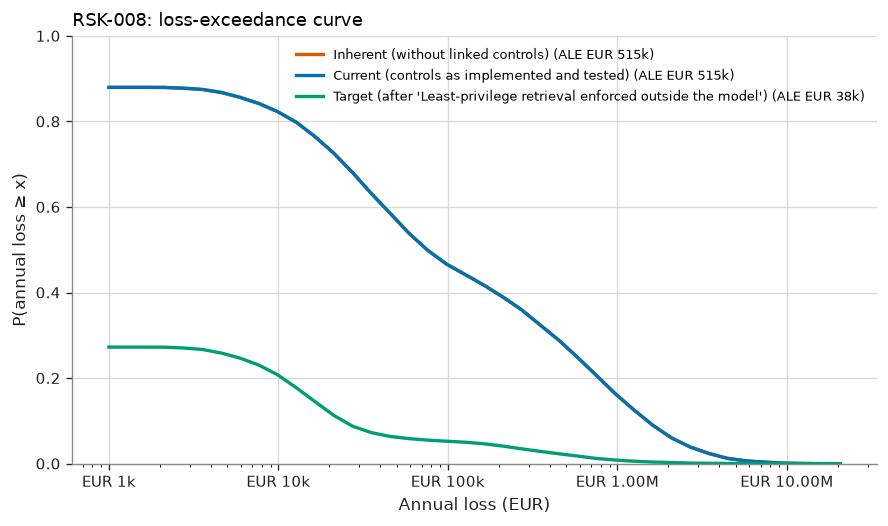
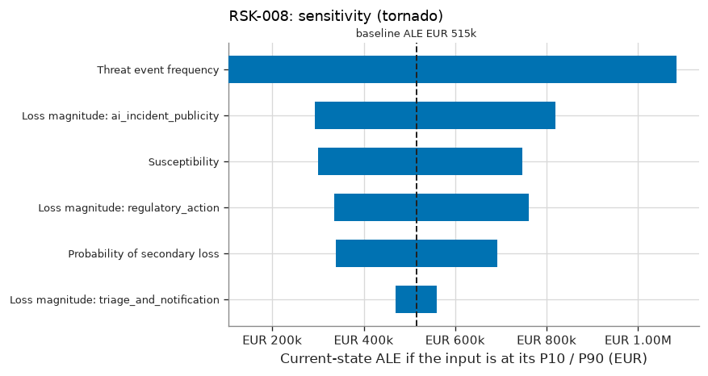

# RSK-008 — LLM assistant discloses other customers' shipment data via prompt injection

RSK-008 LLM assistant discloses other customers' shipment data via prompt injection: current risk 'Low', ALE EUR 515k (90% CI EUR 58k–EUR 1.60M), OUTSIDE appetite.

## What is the estimated risk?

The current expected annual loss (ALE) is EUR 515k, with a 90% credible interval of EUR 58k to EUR 1.60M. The probability of at least one loss event in a year is 88%. In a 1-in-20 bad year, losses reach EUR 2.34M or more (VaR 95%). The average of those worst 5% of years is EUR 4.04M (expected shortfall).

## Why is it at this level?

5.37 expected loss events/yr → likelihood 'Very High'; EUR 94,921 expected loss per event → impact 'Low'. The risk matrix gives 'Low'. The ALE of EUR 515k is compared with the scenario threshold of EUR 500k, and the level with the maximum acceptable level 'Moderate'. The risk is **OUTSIDE appetite**. Given the parameter uncertainty, the probability that the true ALE is within the threshold is 68%.

## How confident are we?

The ALE credible interval spans a factor of 27.4. 1 of 6 inputs are data-derived; the rest are expert judgement or assumptions. The largest single source of uncertainty in the ALE is Threat event frequency (rank correlation +0.89), so better measurement of this input would narrow the estimate most. No controls are credited in the current state. The Monte Carlo error on the ALE is ±EUR 7k (20,000 trials). This is simulation precision only and does not reflect input uncertainty.

## Which controls reduce it?

No control is credited in the current state, so current risk equals inherent risk (EUR 515k). Controls reflected in measured inputs are listed under the assumptions.

## What if the assumptions change?

The main drivers, each moved from its P10 to its P90, are Threat event frequency (EUR 105k–EUR 1.08M), Loss magnitude: ai_incident_publicity (EUR 294k–EUR 819k), Susceptibility (EUR 301k–EUR 747k). Stress tests: TEF ×2: ALE EUR 1.02M (+98%), level 'Low'; Magnitude ×2: ALE EUR 1.03M (+100%), level 'Low'.

## What mitigation has the greatest effect?

The largest risk reduction comes from option T2 'Disable the assistant's shipment-lookup feature': ALE −EUR 515k (±EUR 7k, paired estimate), VaR95 −EUR 2.34M. Its annualised cost is EUR 150k (ROSI +243%), and the residual level would be 'Very Low'. Other options: T1 ALE −EUR 477k, cost EUR 30k/yr. The selected treatment gives a target ALE of EUR 38k ('Low').

## What assumptions were made?

- Loss events follow a Poisson process given the annual rate (events are independent in time).
- Controls acting on the same factor combine multiplicatively (independent layers of defence).
- A control's operating rate is the probability it works for a given event; failures are independent between events.
- Loss forms of the same event are positively correlated through a one-factor Gaussian copula.
- Loss-magnitude ranges describe event-to-event variability; uncertainty about severity parameters is not modelled separately (v1).
- Inherent risk is the risk without the controls linked to the scenario; the wider environment is unchanged.
- Quantitative banding: likelihood from expected loss events per year, impact from expected loss per event.
- Susceptibility is measured against the production guardrails (CTL-AI-01), so CTL-AI-01 is not credited separately, to avoid double counting.
- The cost of T2 is the opportunity cost of lost self-service (fewer deflected contact-centre calls).
- Red-team attempts are assumed representative of real attacker attempts. This is a strong assumption; real attackers adapt.

## Risk states

| State | ALE | 90% credible interval | VaR 95% | ES 95% | P(≥ 1 event) | Loss events/yr | Expected loss/event | Level (L×I) |
|---|---|---|---|---|---|---|---|---|
| Inherent (without linked controls) | EUR 515k | EUR 58k – EUR 1.60M | EUR 2.34M | EUR 4.04M | 88% | 5.37 | EUR 95k | Low (5×2) |
| Current (controls as implemented and tested) | EUR 515k | EUR 58k – EUR 1.60M | EUR 2.34M | EUR 4.04M | 88% | 5.37 | EUR 95k | Low (5×2) |
| Target (after 'Least-privilege retrieval enforced outside the model') | EUR 38k | EUR 4k – EUR 124k | EUR 128k | EUR 682k | 27% | 0.40 | EUR 95k | Low (3×2) |



## Loss breakdown by loss form (current state)

| Loss form | Mean annual amount | Share of ALE |
|---|---|---|
| Reputation | EUR 247k | 48.0% |
| Fines Judgments | EUR 202k | 39.1% |
| Response | EUR 66k | 12.9% |

## Inputs

| Input | Distribution | Provenance | Source | Rationale |
|---|---|---|---|---|
| Threat event frequency | lognormal (median 89.44, 90% range 20–400) | Expert Judgement | Guardrail telemetry, first six months in production | Injection attempts per year that reach the production assistant. |
| Susceptibility | Beta(8, 194), mean 0.040, 90% CI 0.020–0.064 [posterior from 7/200 observed] | Data | LLM red-team report (EV-008) | Share of red-team injection attempts that disclosed out-of-scope data, measured against the production guardrails. |
| Probability of secondary loss | PERT (min 0.05, most likely 0.15, max 0.3) | Expert Judgement | — | — |
| Loss magnitude: triage_and_notification | PERT (min 2,000, most likely 8,000, max 4e+04) | Expert Judgement | — | — |
| Loss magnitude: regulatory_action | lognormal (median 1.265e+05, 90% range 2e+04–8e+05) | Expert Judgement | — | — |
| Loss magnitude: ai_incident_publicity | lognormal (median 1.414e+05, 90% range 2e+04–1e+06) | Expert Judgement | — | — |

## Control assessment

| Control | Conclusion | Basis | Samples | Exceptions | Posterior mean operating rate | 90% interval | Clopper-Pearson upper bound | ALE increase if it failed |
|---|---|---|---|---|---|---|---|---|
| CTL-AI-02 Least-privilege retrieval for the LLM assistant | Not Tested | statistical | 0 | 0 | 50.0% | 5.0% – 95.0% | — | not credited |

<details>
<summary>Control assessment detail</summary>

- **CTL-AI-02**: No operating-effectiveness tests in the last 365 days. The model uses the uninformative prior (mean operating rate 50%). 21 exception-free samples would support an 'effective' conclusion.

</details>

## Treatment options

Effects are compared against the current state **on the same simulated years** (common random numbers), so
the paired standard error is smaller than the independent one; both are shown to make that precision gain
visible.

| Option | Type | ALE | ΔALE (paired SE) | ΔALE independent SE | ΔVaR 95% | Annualised cost | ROSI | Residual level | Within appetite |
|---|---|---|---|---|---|---|---|---|---|
| T2 Disable the assistant's shipment-lookup feature | Avoid | EUR 0 | +EUR 515k (±EUR 7k) | ±EUR 7k | +EUR 2.34M | EUR 150k | +243% | Very Low | ✅ |
| T1 Least-privilege retrieval enforced outside the model | Modify | EUR 38k | +EUR 477k (±EUR 7k) | ±EUR 8k | +EUR 2.22M | EUR 30k | +1489% | Low | ✅ |

## Sensitivity



Rank sensitivity: the Spearman correlation between each epistemic input's draw and the trial's conditional
expected loss, which ranks where better measurement would narrow the ALE estimate the most (top
3 shown).

| Input | Spearman ρ | Share of explained variance |
|---|---|---|
| Threat event frequency | +0.89 | 81.7% |
| Susceptibility | +0.33 | 11.3% |
| Probability of secondary loss | +0.26 | 7.0% |

## Stress tests

Named what-if scenarios, re-simulated on the same random numbers as the current state.

| Stress | Description | ALE | Change vs. current ALE | VaR 95% | Resulting level |
|---|---|---|---|---|---|
| TEF ×2 | Threat event frequency doubles. | EUR 1.02M | +98% | EUR 4.17M | Low |
| Magnitude ×2 | Every loss form costs twice as much. | EUR 1.03M | +100% | EUR 4.69M | Low |

## Evaluation

| | |
|---|---|
| Decision level | Low |
| Scenario ALE appetite threshold | EUR 500k |
| ALE within threshold | ❌ |
| P(true ALE within threshold) | 68% |
| Maximum acceptable level | Moderate |
| Within appetite | ❌ |
| Treatment required | yes |
| Acceptance authority | Executive |
| Max acceptance period | 365 days |
| Review cycle | every 365 days |

The quantitative result is the decision basis (see methodology notes); the qualitative rating is retained for communication and consistency checking. Retaining a risk outside appetite requires the 'executive' authority.

## Findings

No findings.

## Model notes

None.

## Reproducibility

| | |
|---|---|
| Inputs fingerprint | `298ac756dc2ee861346bf6e8721b8523f50e429df00aea9b6fe1384047079fe0` |
| Result fingerprint | `8db7f33311b40624a156ffdabeb4ce4c4ac6a6ac87ebb7ab1cc0e67ea26d475c` |
| Methodology fingerprint | `af488897ff9d125d15832b2b49e050804e644d2c2a3de6ddab4e20e89d284d5a` |
| Engine version | 1.0.0 |
| Library versions | numpy 2.5.3, scipy 1.18.1 |
| Seed | 20260101 |
| Trials | 20,000 |
| As of | 2026-09-01 |

To reproduce this assessment:

```
uv run sextant assess examples/halcyon --scenario RSK-008 --trials 20000 --seed 20260101 --as-of 2026-09-01
```